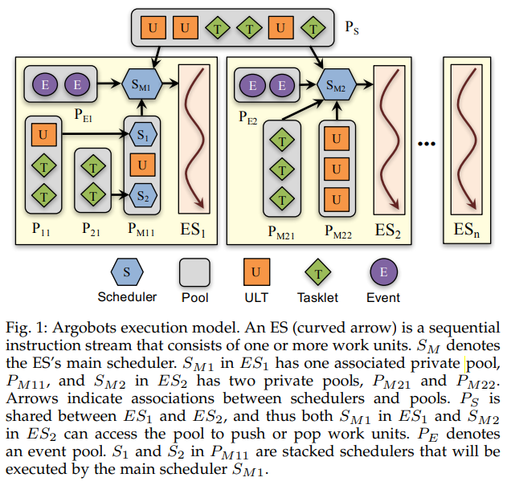

## 执行模型

图一说明了Argobots的执行模型，支持两个级别的并行：ES和工作单元，ES映射为内核线程，由用户创建，不同ES之间相互独立。

工作单元是一个轻量的执行单元，包括ULT或tasklet, 运行在ES中，工作单元在ES内部串行执行，可以在不同ES中并行。

每个ES关联自己的调度器去改变内部工作单元的调度策略，调度器还需要定期处理异步事件。

ULT和Tasklets都是关联函数调用并执行完成，然后，他们每一个都适用于不同的编程场景，ULT由自身的栈区，而tasklet借用宿主ES的调度器堆栈。一个ULT是用户空间的独立执行单元，提供低消耗的上下文切换成本的标准线程语义。

ULT 适用于根据持久性上下文表达并行性，其控制流可以暂停和恢复。

与 OS 级线程不同，ULT 不打算被抢占。 他们合作让出控制权，例如，当他们等待远程数据或让其他工作单元为了公平而取得进展时。 一个 tasklet 是一个不可分割的工作单元，只依赖于它的输入数据，它通常在完成时提供输出数据。 在将控制返回给调用它们的调度程序之前，Tasklet 不会放弃控制并运行完成。

##　调度器

Argobots 为可堆叠或嵌套的调度程序提供基础设施，具有可插入的调度策略，同时利用工作单元的协作非抢占式激活。 本地化的调度策略，例如当前运行时系统中使用的那些，虽然对于短时间执行是有效的，但不知道全局策略和优先级。 插入自定义策略使更高级别的软件堆栈能够使用它们的特殊策略，而 Argobots 则处理低级别的调度机制。 此外，当多个软件模块或编程模型在一个应用程序中交互时，堆叠调度器使用户能够切换调度器。 例如，当应用程序执行一个有自己的调度程序的外部库时，它会暂停当前的调度程序并调用库的调度程序。 这样做会激活与调用的关联的工作单元

Argobots允许每个ES具有自己的调度程序，为了执行工作单元，ES至少有一个主调度器，调度去于一个或多个池关联，在着这些池中，就绪的ULT正在等待执行。pool具有访问属性，例如ES私有或ES之间共享，在调度程序或ES之间共享或窃取工作单元通过共享池完成，每个ES也有一个特殊的**事件池**用于处理异步事件，事件池用于轻量级通知，它由调度器定期检查处理事件的到来（例如，网络请求的消息）

当一个工作单元处于正在运行或堆叠的调度器相关联的池中时，他被认为已经准备好执行，因此，Argobots不控制工作单元之间的依赖关系，控制时通过Argobots提供的机制在应用程序之间完成的，比如等待完成和同步。为了确保工作单元于某些数据的特定亲和性，应用程序在推送工作单元时可以使用适当的池。因此，工作单元将在池中弹出它的ES（或一组ES）上执行。

堆叠调度器时通过将调度器推送到池中实现的，换句话来说，池中的调度器被视为可调度单元（例如，S1和S2都是一个堆叠的调度器，将由SM1调度执行），当一个更高级别的调度器从它的池中弹出一个调度器时，新的调度器开始执行（即调度），一旦完成了调度，控制返回给开始执行的调度器，为了将控制权交还给父类调度器，调度器可以yeild.为了支持插入不同的调度策略，所有调度器（包括主调度器）和池都可以由用户提供代替方案代替。

## 介绍

执行流(ES)是顺序指令流的执行。每条指令不一定是SISD指令，也可能是vector或SIMD指令。当绑定到硬件处理元素(PE)时，ES可以被认为是其软件等价物。Argobots认为每个PE一个ES。Oversubscription of ESs是可能的，但不建议。

ES在概念上是工作单元的容器，这些工作单元是用户级线程(ULTs)或tasklet。工作单元执行到完成，但它们的执行可能在ES内部交错执行。由于ES是一个顺序指令流，因此在单个ES中不能并行执行工作单元。只有一个工作单元运行在某一点上的ES。然而，不同ESs中的工作单元可以并行执行。ES具有隐式管理的进程语义，由内核或硬件处理，被阻塞的ES不能阻塞其他ESs。

每个ES根据调度策略执行所有关联的工作单元。与ES相关联的调度器负责调度。ES有自己的调度器，不同的ESs可以采用不同的调度器。Argobots运行时提供了一些预定义的调度器，但用户也可以创建自己的调度器。

## ES Types1
Argobots将ESs分为两种类型:**Primary**和**Secondary**。主要区别是用户只能创建**Secondary** ES，而不能创建Primary ES。

* Primary ES(**initial** ES): 这是在Argobots库初始化时自动启动的ES。它不能显式创建，而且应用程序只有一个主ES。当主ES启动时，它隐式地包含了一个ULT，它已经启动了main函数。换句话说，当Argobots被初始化时，存在一个包含一个ULT的主ES。初级ESs与次级ESs建立亲子关系。当它终止时，所有次级ESs终止。
* **Secondary ES**:  Secondary ES是指Primary ES之外的ESs。它们是在运行时显式创建的，任何工作单元都可以创建它们。Secondary ESs之间没有亲子关系。一个Secondary ES的终止不影响其他ESs(包括Primary ES和Secondary ES)的执行。

## ES States

ES在执行期间的某个时间点保持一种状态。ES可能的状态有CREATED、READY、RUNNING和TERMINATED，分别对应enum ABT_xstream_state的ABT_XSTREAM_STATE_CREATED、ABT_XSTREAM_STATE_READY、ABT_XSTREAM_STATE_RUNNING和ABT_XSTREAM_STATE_TERMINATED。ES的状态可以通过ABT_xstream_get_state()获获取状态。

下面描述了ES的每个状态:

**CREATED**

* ES创建时的初始状态。

**READY**

* 当ES开始执行时，ES的状态变为READY。Argobots实现可以在创建ES时立即启动ES，或者延迟到任何工作单元与ES相关联，或者用户显式启动ES的执行。一旦ES进入就绪状态，它就会等待就绪状态下的工作单元的创建。

**RUNNING**

* 当存在要执行的工作单元时，ES会移动到运行状态，并且当仍然存在工作单元时，它会保持运行状态。如果没有更多的工作单元要执行，ES会再次将其状态更改为READY。

**TERMINATED**

- 当有join请求时，ES的状态变为终止。在创建状态下，它立即终止。然而，在其他状态，它将在完成所有相关工作单元的执行后终止。它仅在连接请求处于就绪状态时才处理连接请求。
- 当工作单元调用ES exit函数时，无论工作单元是否存在，其关联的ES都会终止，ES的状态也会终止。如果需要，用户必须迁移与终止ES相关联的剩余工作单元。
- 当有一个cancel请求时，ES的状态从所有状态变为终止状态。当一个工作单元正在运行，即ES处于运行状态时，ES将在关联的调度器获得执行机会后终止。和ES的exit函数一样，如果有必要，用户可能需要迁移与即将终止的ES相关的剩余工作单元。