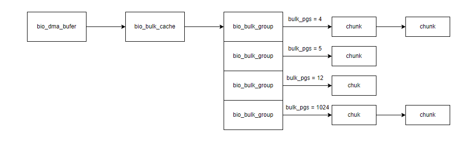
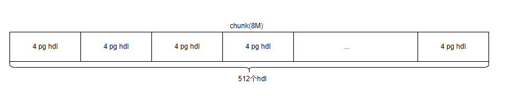

## bulk_map_one

**关键数据结构**

```c
// 单个target中dma buffer缓存结构
struct bio_dma_buffer {
	d_list_t		 bdb_idle_list;
	d_list_t		 bdb_used_list;
	struct bio_dma_chunk	*bdb_cur_chk[BIO_CHK_TYPE_MAX];
	unsigned int		 bdb_used_cnt[BIO_CHK_TYPE_MAX];
	unsigned int		 bdb_tot_cnt;
	unsigned int		 bdb_active_iods;
	unsigned int		 bdb_queued_iods;
	ABT_cond		 bdb_wait_iod;
	ABT_cond		 bdb_fifo;
	ABT_mutex		 bdb_mutex;
	struct bio_bulk_cache	 bdb_bulk_cache;  // 在bulk中只关注这个缓存
	struct bio_dma_stats	 bdb_stats;
	uint64_t		 bdb_dump_ts;
};

/* 用于记录页面组容器 */
struct bio_bulk_cache {
	/* Bulk group array */
	struct bio_bulk_group	 *bbc_grps;  // bulk_group数组, 最大BIO_BULK_GRPS_MAX
	struct bio_bulk_group	**bbc_sorted; // 一个二叉搜索树,用于方便快速找到所需的页面个数对应的组
	unsigned int		  bbc_grp_max; // 最大组个数, 最大BIO_BULK_GRPS_MAX
	unsigned int		  bbc_grp_cnt;  // 当前所分配的组的个数
	/* All groups in LRU */
	d_list_t		  bbc_grp_lru;  // 所有组组成的LRU列表, 可以用来回收时进行遍历
};


//  bulk_group用于记录同一类页面个数,比如1个页面个数的组,2个页面个数的组
struct bio_bulk_group {
	/* Link to bbc_grp_lru */
	d_list_t		 bbg_lru_link;  // LRU缓存列表
	/* All DMA chunks in this group */
	d_list_t		 bbg_dma_chks;  // 该组中所有chunks
	/* All free bulk handles in this group */
	d_list_t		 bbg_idle_bulks;  // 闲置的hdl
	/* Bulk size in pages (4k page) */
	unsigned int		 bbg_bulk_pgs;  // 当前组中的页面个数,1个页面的组,该值为1
	/* How many chunks used for this group */
	unsigned int		 bbg_chk_cnt;  // chunk 的个数
};

struct bio_dma_chunk {
	/* Link to edb_idle_list or edb_used_list or bbg_dma_chks */
	d_list_t	 bdc_link;
	/* Base pointer of the chunk address */
	void		*bdc_ptr;
	/* Page offset (4K page) to unused fraction */
	unsigned int	 bdc_pg_idx;
	/* Being used by how many I/O descriptors */
	unsigned int	 bdc_ref;
	/* Chunk type */
	unsigned int	 bdc_type;
	/* == Bulk handle caching related fields == */
	struct bio_bulk_group	*bdc_bulk_grp;  // 组的描述信息
	struct bio_bulk_hdl	*bdc_bulks;     // 按照组的页面个数进行拆分的hdl
	void			*bdc_bulk_hdl; 	/* Bulk handle used by upper layer caller */
	unsigned int		 bdc_bulk_cnt;
	unsigned int		 bdc_bulk_idle;
};
```



每组代表一类相同页面个数的hdl, 在组中chunk表示一个8M的spdk内存



一组chunk按照组的页面个数进行拆分, 如4个页面的组,将一个chunk拆分成512个hdl

**代码流程**

bulk_map_one

​	dma_biov2pg: 获取数据范围所需要申请的页面个数

​	bulk_get_hdl:  获取bulk句柄

​		bulk_get_shared_hdl

​			获取最近使用的bulk_hdl, 从biod->bd_bulk_hdls缓存列表中获取最后一个元素

​			判断当前的bulk_hdl剩余空间是否能够容纳当前数据

​		bulk_grp_get: 获取页面所对应的组,一个页面只会在一个组中

​			尝试从bbc_grp_lru获取上一个操作的组, 如果和当前的页面个数一致,直接返回组

​			从bbc_sorted二叉搜索树找到大于等于的组, 如果相等将组添加到LRU缓存中返回

​			bulk_grp_add: 添加新组

​				如果当前的组数小于最大组数(64), 直接新生成一个组,并将当前组添加到二分查找树bbc_sorted中

​				如果当前的组数已经等于最大组数, 找到闲置组尝试驱逐(或者说是将其他大页面组分裂成当前页面大小)来适应当前组

​				bulk_grp_reset: 从新设置当前组的页面个数

​		bulk_grp_grow: 如果没有找到合适的组,进行组增长

​			d_list_empty(&bdb->bdb_idle_list): 如果由闲置的chunk, 直接使用闲置的chunk来做组的chunk数据

​			dma_buffer_grow: 没有闲置的chunk且当前chunk数量没有超限,  重新申请一个chunk

​			bulk_reclaim_chunk: 尝试回收一个组的chunk来给当前组使用

​			bulk_chunk_populate: 填充chunk

​				按照当前的页面个数进行将chunk进行拆分, 当然申请bdc_bulks内存按照最大bio_chk_sz进行申请的, 主要是为了驱逐复用的时候防止从新申请

## dma_buf_one

存在以下几种情况, 几种情况只会满足一个

* 当申请的页面个数大于一个chunk承受的最大页面个数(bio_chk_sz), 直接通过dma_alloc_chunk申请大叶内存,用完就释放
* 使用上次的预留区域, 如果上次剩余的满足本次申请的页面个数,直接使用上次剩余的
* 当前页面chunk个数小于阈值,直接重新申请一个8M大小的chunk
* 通过回收闲置的chunk进行使用

​			

​	

​		