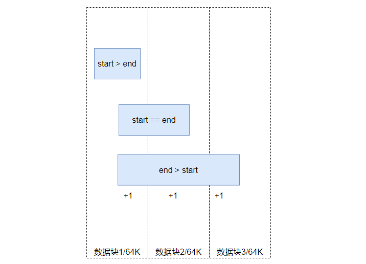
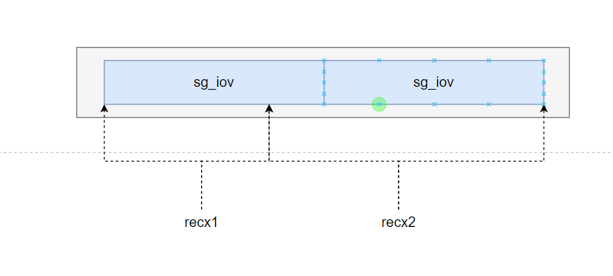
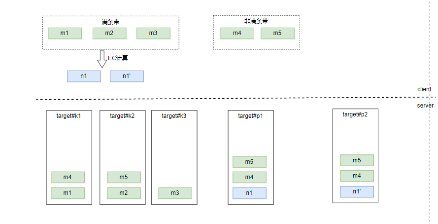
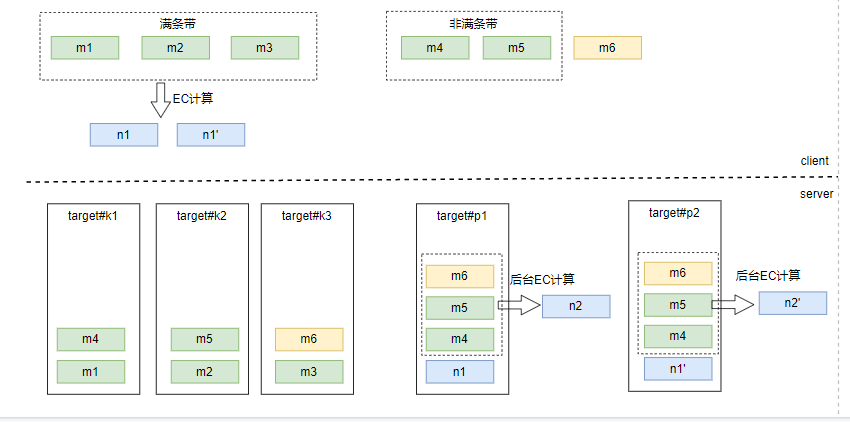

# obj_rw_req_reassemb

以下例子都是用数据块大小为64K,EC为3+2模式来说明

## obj_ec_recx_scan

对daos_iod_t中的每个recx区域进行扫描,对于满条带的记录到obj_ec_recx_array中,非满条带服务端会满条带之后聚合

计算start和end位置,当start >= end是非满条带,只会计算所占数据块个数

 start = roundup(recx->rx_idx, stripe_rec_nr);

 end = rounddown(recx->rx_idx + recx->rx_nr, stripe_rec_nr);

对于满条带数据

ec_recx[idx].oer_recx.rx_idx = start;  // 满条带对齐的起始偏移

ec_recx[idx].oer_recx.rx_nr = rec_nr;  // rec_nr = end - start, 满条带个数

分配SGL

d_sgl_init(&reasb_req->orr_sgls[iod_idx],  seg_nr + sgl->sg_nr);

### seg_nr统计

seg_nr += obj_ec_recx_cell_nr(recx, oca);

```c
static inline uint32_t
obj_ec_recx_cell_nr(daos_recx_t *recx, struct daos_oclass_attr *oca)
{
	uint64_t	recx_end, start, end;

	recx_end = recx->rx_idx + recx->rx_nr;
	start = roundup(recx->rx_idx, obj_ec_cell_rec_nr(oca));
	end = rounddown(recx_end, obj_ec_cell_rec_nr(oca));
    // 范围凑不满一个数据块
	if (start > end)
		return 1;
    // 对于start_
	return (end - start) / obj_ec_cell_rec_nr(oca) +
	       ((recx->rx_idx % obj_ec_cell_rec_nr(oca)) != 0) +
	       ((recx_end % obj_ec_cell_rec_nr(oca)) != 0);
}
```

如果数据块是64K, 分布情况如下, 对于凑不满一个数据块的当一个数据块处理,



对于sgl->sg_nr > 1的情况分析, 再libdaos提供的数组接口中,将离散的SGL当作连续的来看,并不存在recx交叉场景,不然再create_sgl流程就会出现问题, 虽未key-array,相当于对一块连续看作连续内存的数据进行划分,当然sg_iov可能是离散的.



## obj_ec_recx_reasb

ec_data_recx_add: 添加描述信息

ec_data_seg_add: 添加分片信息到sorter

obj_ec_seg_pack: 将EC排序后的数据组装到sgl

## obj_ec_encode

只对满条带的数据进行EC计算

obj_ec_recx_encode

​	obj_ec_stripe_encode

​		  ec_encode_data: 调用算法


## EC 操作原理分析

在DAOS中EC的数据块依次分布到不同的target上, 如数据块cell_size为64K, 3+2模式下, 会将数据块依次分布到target上, 如果客户端满条带数据会计算EC, 非满条带数据会将数据复制到校验target上



当校验的target发现EC已经满条带, 进行后台EC聚合, 并删除数据



## 总结

对于非满条带的来说,会将数据复制到验证块target上,当数据满条带之后通过后台的聚合任务进行计算EC,并删除检验target冗余的数据.

* 比如3 + 2模式下, 如果chunksize = 64K, 如果数据只有128K, 不能满条带,数据会往校验块的target冗余2份

* 当数据凑齐满条带之后,服务端后台聚合数据块生成校验块,删除冗余的数据块

