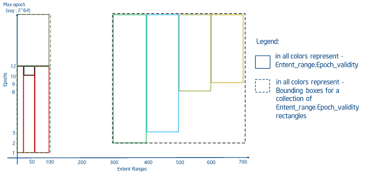

## Key Array Stores

VOS支持键-数组对象，与KV存储类似，数组对象允许多个版本，并且必须能够同时写入、读取和输入字节范围的任何部分。下图展示了键-数组对象中的区段和纪元安排的一个简单示例。在本例中，不同的线表示存储在各自区段中的实际数据，并对写入该区段范围的不同**线程**进行颜色编码。

**Example of extents and epochs in a Key Array object**

在上面的例子中，不同的区段范围之间有显著的重叠。VOS支持最近历元访问(nearest-epoch access)，这要求读取任何给定区间的最新值。

例如，在上面的[图](https://github.com/daos-stack/daos/tree/master/src/vos#7f)中，如果对纪元10的区段范围4- 10有一个读请求，那么结果读取缓冲区应该包含纪元9的区段7-10、纪元5的区段5-7和纪元1的区段4-5。VOS数组对象还支持部分范围和完整范围的punch。

**Example Input for Extent Epoch Table**

| Extent Range | Epoch | Write (or) Punch |
| ------------ | ----- | ---------------- |
| 0 - 100      | 1     | Write            |
| 300 - 400    | 2     | Write            |
| 400 - 500    | 3     | Write            |
| 30 - 60      | 10    | Punch            |
| 500 - 600    | 8     | Write            |
| 600 - 700    | 9     | Write            |

R -树提供了一种合理的方式来表示extent和epoch有效性范围，从而限制处理读请求所需的搜索空间。VOS提供了一种特殊的R树，称为区间有效性树(Extent-Validity tree, EV-Tree)来存储和查询版本化数组索引。在传统的R树实现中，矩形是有界且不可变的。在VOS中，“矩形”由一个轴上的范围和另一个轴上的纪元有效性范围组成。然而，在插入矩形时，历元的有效范围是未知的，因此所有矩形的插入都是假设上界为无穷大。最初，DAOS设计要求在insert上分裂这种in-tree矩形以限制有效性范围，但由于一些因素导致决定保持原始有效性范围。首先，更新持久性内存的开销比查找高一个数量级。其次，快照之间的重写可以通过聚合删除，从而保持相当小的重叠写入历史。因此，EV-Tree实现了一个由两部分组成的取指算法。

1. 找出所有重叠区段。这将包括请求周期之前发生的所有写操作，即使它们已经被后续的写操作覆盖。
2. 按范围开始，然后按纪元排序
3. 遍历有序数组，必要时拆分区段并尽可能地标记它们
4. 重新排序数组。最后的排序可以根据用例选择保留或丢弃空洞和覆盖的区段。

TODO:创建一个新的图形Rectangles表示extent_range。epoch_validity使用上面的表

[

下图[下图](https://github.com/daos-stack/daos/blob/master/src/vos/7l)显示了使用EV-Tree的分裂和裁剪操作构造的矩形，用于前面[表](https://github.com/daos-stack/daos/tree/master/src/vos#7g)中的示例，在偏移量{0 - 100}处额外写入，以考虑广泛分裂的情况。上图[上图](https://github.com/daos-stack/daos/tree/master/src/vos#7k)显示了相同示例的EV-Tree构造。

**树(order- 4)，用于表中的示例(如图6 - 3所示)**

EV树中的插入通过检查重叠来定位要插入的适当叶节点。如果多个边界框重叠，则选择放大最小的边界框。通过选择面积最小的边界框来解决进一步的连接。每次插入操作的最大开销可能是O (logbn)。

除了上面描述的假重叠问题之外，EV-Tree的搜索工作与R-Tree类似。必须寻找所有重叠的内部节点，直到找到匹配的内部节点和叶节点。由于区间范围可以跨越多个矩形，因此一次搜索可以搜索到多个矩形。在理想情况下(整个区间都落在一个矩形上)，读取开销为O(logbn)，其中b是树的顺序。排序和拆分阶段会增加O(n log n)的额外开销，其中n是匹配的区段数量。在最坏的情况下，这相当于树中的所有区段，但由于聚合和单个键对应的单个分片对应的树相对较小，这种情况会得到缓解。

对于从ev树中删除节点，可以使用与搜索相同的方法来定位节点，并且可以删除节点/槽。一旦叶子节点被删除，为了合并多个表项数小于order/2的叶子节点，需要进行重新插入。EV-tree会进行重新插入(而不是像B+树那样合并叶节点)，因为在删除叶节点/叶槽时，边界框的大小会发生变化，并且确保矩形组织成最小边界框而没有不必要的重叠是很重要的。在VOS中，仅在聚合和丢弃操作时需要delete。这些操作将在下一节中讨论([基于纪元的操作](https://github.com/daos-stack/daos/tree/master/src/vos#74))。