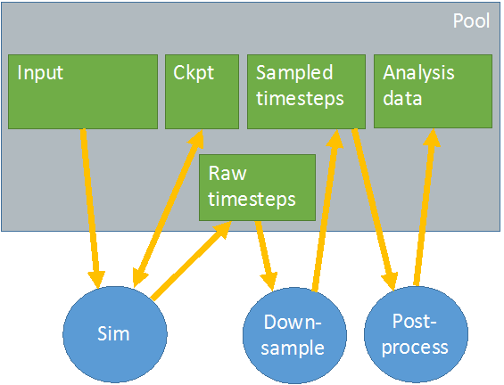

# 使用案例

本节提供了一个非详尽的用例列表，展示了如何在实际 HPC 集群上使用 DAOS 存储模型和堆栈。

本文档包含以下部分：

- [存储管理和工作流集成](https://docs.daos.io/v2.2/overview/use_cases/#61)
- 工作流执行
  - [批量同步检查点](https://docs.daos.io/v2.2/overview/use_cases/#63)
  - [生产者/消费者](https://docs.daos.io/v2.2/overview/use_cases/#64)
  - [并发生产者](https://docs.daos.io/v2.2/overview/use_cases/#65)
- [存储节点故障和重新同步](https://docs.daos.io/v2.2/overview/use_cases/#66)

## 存储管理和工作流集成

在本节中，我们将研究两种不同的群集配置：

- 群集 A：所有或大多数计算节点都具有本地持久内存。换句话说，每个计算节点也是一个存储节点。
- 群集 B：存储节点专用于存储并跨结构传播。它们不用于计算，因此不运行任何应用程序代码。

在引导时，每个存储节点都会启动实例化服务线程的 DAOS 服务器。在集群 A 中，DAOS 线程绑定到噪声内核，并在使用 mOS 时与 FWK 交互。在群集 B 中，DAOS 服务器可以使用存储节点的所有内核。

然后，DAOS 服务器加载存储管理模块。此模块扫描节点上的本地存储，并将结果报告给指定的主 DAOS 服务器，该服务器聚合有关集群中已用和可用存储的信息。管理模块还检索容错域层次结构（从数据库或特定服务），并将其与存储信息集成。

然后，资源管理器使用 DAOS 管理 API 查询可用存储，并为要计划的新工作流分配一定量的存储（即持久内存）。在群集 A 中，此分配请求可能会列出应运行工作流的计算节点，而在 B 中，它可能会要求在某些分配的计算节点附近进行存储。

成功分配后，主服务器将通过格式化 VOS 布局（即 fallocate（1） 一个 PMEM 文件并创建 VOS 超级块）并启动池服务来初始化覆盖分配存储的 DAOS 池，该服务将启动负责池成员资格和元数据的 Raft 引擎。此时，DAOS 池已准备好移交给实际工作流。

工作流启动时，一个等级连接到 DAOS 池，然后使用 local2global（） 生成全局连接句柄，并与使用 global2local（） 创建本地连接句柄的所有其他应用程序等级共享该句柄。此时，可以创建新容器，并通过应用程序任务集体或单独打开现有容器。

## 工作流执行

我们[考虑下图中](https://docs.daos.io/v2.2/overview/use_cases/#6a)表示的工作流程。

每个绿色框代表一个不同的容器。所有容器都存储在由灰色框表示的同一 DAOS 池中。模拟从输入容器读取数据，并将原始时间步长写入另一个容器。它还定期将检查点转储到专用的 ckpt 容器中。下采样作业读取原始时间步长并生成采样时间步长，以供后处理分析，后处理将分析数据存储到另一个容器中。

### 批量同步检查点[¶](https://docs.daos.io/v2.2/overview/use_cases/#bulk-synchronous-checkpoint)

防御性 I/O 用于在大于平台平均故障间隔时间 （MTBF） 的时间段内管理大型模拟运行。模拟会定期将当前计算状态转储到专用容器中，该容器用于在发生故障时保证向前推进。本节详细说明了如何在 DAOS 存储堆栈之上实现支票。我们首先考虑依赖于阻塞障碍的传统方法，然后是更松散耦合的执行。

**阻挡屏障**

当模拟作业启动时，一个任务将打开检查点容器并获取当前的全局 HCE。然后，它获取纪元保留并与对等任务共享数据（容器句柄、当前 LHE 和全局 HCE）。每个任务通过读取与全局 HCE 相等的纪元来检查保存到检查点容器的最新计算状态，并从上次检查点的位置恢复计算。

对于检查点，每个任务执行一个屏障以与其他任务同步，将其当前计算状态写入 epoch LHE 的检查点容器，刷新所有更新，最后执行另一个屏障。一旦所有任务都完成了最后一个障碍，一个指定的任务（例如排名 0）提交 LHE，然后在成功提交时增加 1。此过程会定期重复，直到模拟成功完成。

**无阻塞屏障**

我们现在考虑另一种检查点方法，其中执行更松散耦合。与前面的情况一样，一个任务负责打开检查点容器、获取全局 HCE、获取纪元保留并与其他对等任务共享数据。但是，任务现在可以按照自己的节奏检查其计算状态，而无需相互等待。在计算 N 个时间步之后，每个任务将其状态转储到纪元 LHE+1 的检查点容器中，刷新更改并在完成后调用非阻塞屏障（例如 MPI_Ibarrier（））。然后，在另一个 N 个时间步之后，用纪元 LHE+2 写入新的检查点，依此类推。对于每个检查点，纪元编号递增。

此外，每个任务都会定期调用MPI_Test（）来检查屏障的完成情况，从而允许他们回收MPI_Request。障碍完成后，一个指定的任务（通常等级为 0）也会提交关联的纪元编号。保证按顺序提交所有纪元，并且每个已提交的纪元都是一个新的一致检查点，可以从中重新启动。失败时，由各个任务写入但未提交的检查点状态将自动回滚。

### 生产者/消费

在上[图中](https://docs.daos.io/v2.2/overview/use_cases/#6a)，我们有两个生产者/消费者的例子。下采样作业使用模拟作业生成的原始时间步长，并生成由后处理作业分析的采样时间步长。DAOS 堆栈为生产者/消费者工作流程提供了特定的机制，甚至允许消费者将其分析结果转储到与生产者相同的容器中。

**私人容器**

下采样作业打开采样的时间步长容器，获取当前全局 HCE，获取纪元保留，并在纪元 LHE 处将新的采样数据写入此容器。发生这种情况时，后处理作业会打开存储分析数据的容器以进行写入，检查最新分析的时间步长，并获取此容器的纪元保留。然后，它会打开采样的时间步长容器进行读取，并检查要使用的下一个时间步是否已准备就绪。如果没有，它将等待提交新的全局 HCE（由事件队列上的异步事件完成通知）并再次检查。当请求的时间步长可用时，下采样作业将处理此新时间步的输入数据，将结果转储到自己的容器中，并更新其元数据中最新分析的时间步长。然后，它将更新提交到其输出容器，并再次等待提交新的纪元并重复相同的过程。

另一种方法是让生产者作业为感兴趣的纪元创建显式快照，并让分析作业等待和处理快照。这样可以避免处理每个已提交的纪元。

**共享容器**

我们现在假设存储采样时间步长的容器和存储分析数据的容器是单个容器。换句话说，下采样作业使用输入数据并将输出数据写入同一容器。

下采样作业打开共享容器，获取保留并将新的采样时间步转储到容器。与以前一样，后处理作业还会打开容器，获取最新分析的时间步长，但在新的全局 HCE 准备就绪之前不会获得纪元保留。一旦后处理作业收到新的全局 HCE 通知，它就可以分析新的采样时间步长，获取保留并将其分析的数据写入同一容器。完成此操作后，后处理作业将刷新其更新，提交保留纪元并释放已保存纪元。此时，它可以再次等待下采样作业生成新的全局 HCE。

### 并发生产者

在上一节中，我们考虑了一个生产者和一个使用者作业同时读取和写入同一个容器，但在不相交的对象中。现在，我们考虑由并发创建者作业组成的工作流，以冲突和不协调的方式修改同一容器。这实际上意味着两个生产者可以更新同一 KV 对象或文档存储的相同键或同一字节数组的重叠扩展数据块。此模型需要实现并发控制机制（不是 DAOS 的一部分）来协调冲突的访问。本节介绍了基于锁定的此类机制的示例，但也可以考虑其他方法。

工作流由两个应用程序组成，使用分布式锁管理器来序列化对 DAOS 对象的争用访问。每个应用程序单独打开同一个容器，并在想要修改容器中的某些对象时获取纪元保留。在修改对象之前，应用程序应在对象上获取写锁定。此锁带有一个锁值块 （LVB），用于存储上次修改和提交此对象的最后一个纪元编号。获取锁后，编写器必须：

- 从等于 LVB 和句柄 LRE 中指定的最大纪元的纪元读取。
- 提交纪元高于 LVB 和当前持有纪元的新写入。

在应用程序完成、刷新和提交所有 I/O 操作后，将使用修改对象的已提交纪元更新 LVB，并且最终可以释放锁。

## 存储节点故障和重新同步

在本节中，我们将研究连接到 DAOS 池和一个突然发生故障的存储节点的工作流。与故障服务器通信的 DAOS 客户端和服务器都会遇到 RPC 超时并通知 RAS 系统。失败的 RPC 将重复重新发送，直到 RAS 系统或池元数据服务本身决定声明存储节点死亡并将其从池映射中逐出。池映射更新以及新版本将传播到所有存储节点，这些节点会延迟（在 RPC 回复中）通知客户端有新的池映射版本可用。因此，客户端和服务器最终都会收到故障通知并进入恢复模式。

服务器节点将合作为受影响的对象恢复不同服务器上的冗余，而客户端将进入降级模式并从其他副本读取，或从纠删码重建数据。此重建过程在容器仍在访问和修改时联机执行。为所有对象恢复冗余后，池映射将再次更新，以通知每个人系统已从故障中恢复，系统可以退出降级模式。