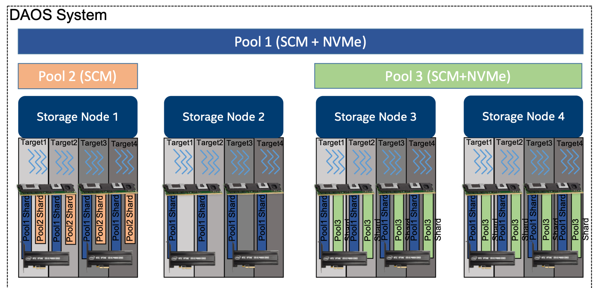

# 存储模型

## 概念

[下图代表了 ](https://docs.daos.io/v2.2/overview/storage/#f4.1)DAOS 存储模型的基本抽象。



DAOS *pool 是指预分配的存储空间，这些存储空间分布在多个*target*。在每个Target上分配给pool的实际空间称为*pool shared。分配给pool的总空间在创建时决定。随着时间的推移，可以通过调整所有pool shared的大小（在每个target专用的存储容量限制内）或添加更多target（添加更多pool shared）来扩展。pool提供存储虚拟化，是预配和隔离的单元。DAOS  pool不能跨多个系统。

一个pool可以托管多个称为 DAOS *容器*的事务对象存储。每个容器都是一个私有对象地址空间，可以独立于存储在同一池中的其他容器进行事务性修改。容器是快照和数据管理的单元。属于容器的 DAOS 对象可以分布在池的任何目标上，以提高性能和弹性，并且可以通过不同的 API 访问，以有效地表示结构化、半结构化和非结构化数据

下表显示了每个 DAOS 概念的目标可扩展性级别。

| DAOS概念  | 可扩展性（数量级）                                           |
| :-------- | :----------------------------------------------------------- |
| System    | 10^5 Servers (hundreds of thousands) and 10^2 Pools (hundreds) |
| Server    | 10^1 Targets (tens)                                          |
| Pool      | 10^2 Containers (hundreds)                                   |
| Container | 10^9 Objects (billions)                                      |

## DAOS POOL

pool由唯一的*pool  UUID* 标识，并在称为*pool映射*的持久版本化列表中维护目标成员身份。成员资格是确定和一致的，成员资格的变化是按顺序编号的。池映射不仅记录活动目标的列表，还包含树形式的存储拓扑，用于标识共享公共硬件组件的目标。例如，树的第一级可以表示共享同一主板的目标，然后第二级可以表示共享同一机架的所有主板，最后第三级可以表示同一机箱中的所有机架。此框架有效地表示分层容错域，然后使用这些域来避免将冗余数据放置在受相关故障影响的目标上。在任何时间点，都可以将新目标添加到池映射中，并且可以排除失败的目标。此外，池映射是完全版本化的，这有效地为映射的每次修改分配了一个唯一的序列，特别是对于失败的节点删除。

池分片是持久内存的预留，可以选择与特定目标上的 NVMe 存储上的预分配空间结合使用。它具有固定容量，满载时无法操作。可以随时查询当前空间使用情况，并报告存储在池分片中的任何数据类型使用的字节总数。

当目标发生故障并从池映射中排除时，池内的数据冗余将自动联机恢复。这种自我修复过程称为*重建*。重建进度会定期记录在存储在持久内存中的池中的特殊日志中，以解决级联故障。添加新目标时，数据会自动迁移到新添加的目标，以便在所有成员之间平均地重新分配空间使用情况。此过程称为*空间重新平衡*，并使用专用的持久日志来支持中断和重新启动。池是分布在不同存储节点上的一组目标，数据和元数据通过这些目标进行分发以实现水平可扩展性，并进行复制或纠删码以确保持久性和可用性。

创建池时，必须定义一组系统属性来配置池支持的不同功能。此外，用户可以定义将永久存储的属性。

只有经过身份验证和授权的应用程序才能访问池。可以支持多个安全框架，从NFSv4访问控制列表到基于第三方的身份验证（如Kerberos）。连接到池时强制实施安全性。成功连接到池后，连接上下文将返回到应用程序进程。

如前所述，池存储许多不同类型的持久性元数据，例如池映射、身份验证和授权信息、用户属性、属性和重建日志。此类元数据至关重要，需要最高级别的复原能力。因此，池元数据从不同的高级容错域复制到几个节点上。对于具有数十万个存储节点的超大型配置，这些节点中只有一小部分（大约数十个）运行*池元数据服务*。在存储节点数量有限的情况下，DAOS 可以依靠共识算法达成协议，保证故障时的一致性，并避免裂脑综合症。

若要访问池，用户进程应连接到此池并通过安全检查。一旦被授予，池连接就可以（通过`local2global()`和`global2local()`操作）与其任何或所有对等应用程序进程共享（类似于`openg()` POSIX扩展）。此集合连接机制有助于避免在数据中心上运行大规模分布式作业时出现元数据请求风暴。当发出连接请求的原始进程与池断开连接时，将撤销池连接。

## DAOS 容器

容器表示池中的对象地址空间，由*容器 UUID* 标识。下图显示了用户（I/O 中间件、特定于域的数据格式、大数据或 AI 框架等）如何使用容器概念来存储相关数据集。


与池一样，容器可以存储用户属性。必须在容器创建时传递一组属性，以配置不同的功能，如校验和。

若要访问容器，应用程序必须首先连接到池，然后打开容器。如果应用程序有权访问容器，则返回容器句柄。这包括授权应用程序中的任何进程访问容器及其内容的功能。打开进程可以与其任何或所有对等方共享此句柄。它们的功能在容器关闭时被撤销。

容器中的对象可能具有不同的架构，用于目标上的数据分发和冗余。动态或静态条带化、复制或纠删码是定义对象架构所需的一些参数。对象类为一组对象定义公共架构属性。每个对象类都分配有一个唯一标识符，并与池级别的给定架构相关联。可以随时使用可配置的架构定义新的对象类，该架构在创建后是不可变的（或至少在属于该类的所有对象都被销毁之前）。为方便起见，默认情况下，将在创建池时预定义几个预期最常用的对象类，如下[表](https://docs.daos.io/v2.2/overview/storage/#t4.2)所示。

**预定义对象类的示例**

| Object Class (RW = read/write, RM = read-mostly | Redundancy   | Layout (SC = stripe count, RC = replica count, PC = parity count, TGT = target |
| :---------------------------------------------- | :----------- | :----------------------------------------------------------- |
| Small size & RW                                 | Replication  | static SCxRC, e.g. 1x4                                       |
| Small size & RM                                 | Erasure code | static SC+PC, e.g. 4+2                                       |
| Large size & RW                                 | Replication  | static SCxRC over max #targets)                              |
| Large size & RM                                 | Erasure code | static SCx(SC+PC) w/ max #TGT)                               |
| Unknown size & RW                               | Replication  | SCxRC, e.g. 1x4 initially and grows                          |
| Unknown size & RM                               | Erasure code | SC+PC, e.g. 4+2 initially and grows                          |

如下所示，容器中的每个对象都由唯一的 128 位*对象地址*标识。对象地址的高 32 位保留给 DAOS 对内部元数据（如对象类）进行编码。其余 96 位由用户管理，在容器内应该是唯一的。只要保证单性，堆栈的上层就可以使用这些位对其元数据进行编码。DAOS API 中提供了每个容器的 64 位可扩展对象 ID 分配器。应用程序要存储的对象 ID 是完整的 128 位地址，仅供一次性使用，只能与单个对象架构关联。

**DAOS 对象 ID 结构**

```
<---------------------------------- 128 bits ---------------------------------->
--------------------------------------------------------------------------------
|DAOS Internal Bits|                Unique User Bits                           |
--------------------------------------------------------------------------------
<---- 32 bits ----><------------------------- 96 bits ------------------------->
```

容器是事务和版本控制的基本单元。所有对象操作都由 DAOS 库隐式标记，时间戳称为**epoch**。DAOS 事务 API 允许将多个对象更新合并到单个原子事务中，并具有基于纪元排序的多版本并发控制。可以定期*聚合*所有版本化更新，以回收重叠写入占用的空间并降低元数据复杂性。快照是可以放置在特定纪元以防止聚合的永久引用。

容器元数据（快照列表、容器打开句柄、对象类、用户属性、属性等）存储在持久内存中，并由专用容器元数据服务维护，该服务使用与父元数据池服务相同的复制引擎，或者具有自己的引擎。这是在创建容器时可配置的。

与池一样，对容器的访问由容器句柄控制。若要获取有效的句柄，应用程序进程必须打开容器并通过安全检查。然后，可以通过容器 `local2global()`） 和 `global2local()` 操作与其他对等应用程序进程共享此容器句柄。

## DAOS 对象

为了避免传统存储系统常见的扩展问题和开销，DAOS 对象有意简化。除了类型和架构之外，未提供默认对象元数据。这意味着系统不维护时间、大小、所有者、权限，甚至不跟踪打开器。为了实现高可用性和水平可伸缩性，提供了许多对象模式（复制/纠删码、静态/动态条带化等）。架构框架非常灵活且易于扩展，以允许将来使用新的自定义架构类型。布局是在从对象标识符和池映射打开的对象上以算法方式生成的。通过在网络传输和存储期间使用校验和保护对象数据，确保端到端完整性。

DAOS 对象可以通过不同的 API 访问：

- **多级键数组**API 是具有局部性的本机对象接口。键拆分为分布键 （dkey） 和属性键 （akey）。dkey 和 akey 都可以是可变的长度和类型（字符串、整数甚至复杂的数据结构）。保证同一 dkey 下的所有条目都并置在同一目标上。与 akey 关联的值可以是无法部分覆盖的单个可变长度值，也可以是固定长度值的数组。键和双键都支持枚举。
- **键值**API 提供了一个简单的键和可变长度值接口。它支持传统的放置，获取，删除和列出操作。
- **数组 API** 实现由 64 位偏移量寻址的固定大小元素的一维数组。DAOS 数组支持任意扩展读取、写入和打孔操作。