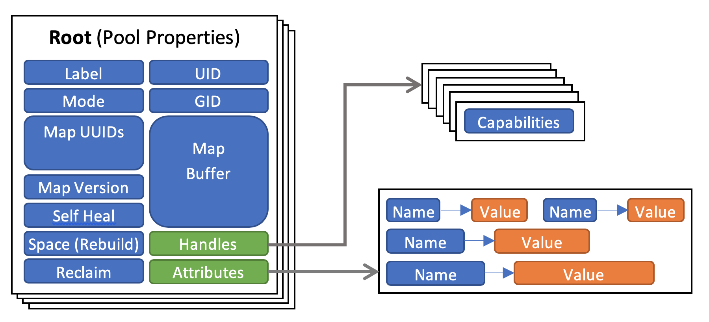

# DAOS Pool

pool是分布在不同存储节点上的一组target，数据和元数据分布在这些节点上，以实现水平可伸缩性，并复制或纠删编码以确保持久性和可用性(参见:[存储模型](/docs/overview/storage.md# DAOS - Pool ))。

## Pool Service

Pool服务(`pool_svc`)存储池的元数据，并提供一个API来查询和更新池配置。池元数据被组织为键值存储(KVS)的层次结构，在使用强领导力的Raft共识协议支持的许多服务器上进行复制;客户端请求只能由service leader处理，而非leader副本只会返回一个指向当前leader的提示，让客户端重试(客户端依次重试)。`pool_svc`派生自一个通用的复制服务模块`rsvc`(参见:[Replicated Services: architecture ](/src/rsvc/README.README.md#architecture))，其实现方便客户端搜索当前领导者。

#### Metadata Layout

顶层KVS存储池映射、安全属性如UID、GID和模式、与空间管理和自愈相关的信息(参见:<a href="/src/rebuild/README.md"> rebuild </a>)以及包含用户定义属性的二级KVS(参见: <a href="/src/container/README.md#metadata-layout">Container Service: Metadata Layout</a>)。此外，它还存储池连接的信息，由pool handle表示，由客户端生成的句柄UUID标识。术语"pool connect"和"pool handle"可以互换使用。

## Pool Operations

#### Pool / Pool Service Creation

池的创建完全由管理服务驱动，因为它需要与分配存储和查询故障域相关的步骤的特殊权限。格式化所有目标后，管理模块通过调用`ds_pool_svc_dist_create`将控制权传递给池模块，该模块为组合池和容器服务在选定的节点子集上初始化服务复制。Pool模块现在向创建服务数据库的service leader发送一个`POOL_CREATE`请求;然后，目标及其故障域的列表将转换为池映射的初始版本，并与其他初始池元数据一起存储在池服务中。

#### Pool Connection

要建立池连接，客户端进程使用池UUID、连接信息(如组名称和服务等级列表)和连接标志调用客户端库中的`daos_pool_connect`方法;这会向pool svc发起一个`POOL_CONNECT`请求。pool svc尝试根据使用中的安全模型(例如:类似posix模型中的UID/GID)对请求进行身份验证，并将所请求的功能授权给客户端生成的池句柄UUID。在继续之前，池映射被传输到客户端;如果从这一点开始出现错误，服务器可以简单地要求客户端放弃池映射。

在这一点上，池服务检查现有的池句柄:

- 如果已经存在具有相同UUID的池句柄，则已经建立了池连接，无需再做其他操作。
- 如果存在另一个池句柄，使得当前请求或现有的句柄具有**独占访问权限**，则连接请求将以繁忙状态码被拒绝。

如果一切顺利，池服务会用池句柄UUID向池中的所有目标发送一个集合的`POOL_TGT_CONNECT`请求。目标服务创建并缓存本地池对象，并打开本地VOS池进行访问。

一组对等应用程序进程可以共享一个连接池句柄(参见:[存储模型:DAOS Pool](/docs/overview/storage.md#DAOS-Pool)(global2local, local2global)  和 用例:存储管理和工作流集成)。

要关闭池连接，客户端进程使用池句柄调用客户端库中的`daos_pool_disconnect`方法，触发向池服务的`POOL_DISCONNECT`请求，该请求将向池中的所有目标发送一个集合的`POOL_TGT_DISCONNECT`请求。这些步骤会销毁与连接相关的所有状态，包括所有容器句柄。共享这个连接的其他客户端进程应该在本地销毁它们的池句柄副本，最好是在所有客户端调用disconnect方法之前销毁。如果一组客户端进程在有机会调用池断开方法之前提前终止，那么一旦池服务从运行时环境中了解到事件，它们的池连接最终将被清除。