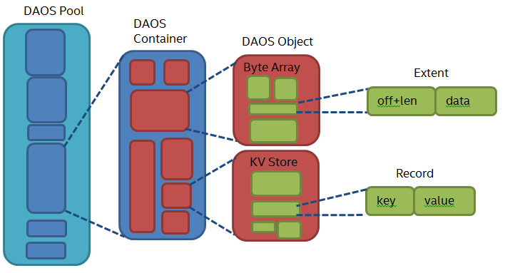

# Object

DAOS对象存储用户数据，它由对象ID标识，该对象ID在其所属的**DAOS容器中是唯一的**。为了性能和弹性，对象可以分布在池的任何目标上。下面的图有助于理解DAOS对象在存储层次结构中的位置。

[](https://github.com/daos-stack/daos/blob/master/docs/graph/Fig_002.png)

object模块实现了object I/O栈。为了避免传统存储栈常见的扩展问题和开销，dao对象故意设计得非常简单。除了对象类型和类之外，没有提供默认的对象元数据。这意味着系统不会维护昂贵的属性，如访问时间、大小、所有者或权限，也不会跟踪对象的打开者。

## KV store, dkey and akey

每个DAOS对象都是具有局部性特性的键值存储。键被分成一个**dkey**(分发键)和**akey **(属性键)。具有相同dkey的所有项都保证被配置在同一个target上。提供了dkey的key的枚举。

key对应的值可以是原子的**单值**(即更新时替换的值)，也可以是**数组值(多值)**(即任意区间的获取/更新)。

## Object Type

object类型定义了键的类型，某些情况下还定义了值的类型。这允许引擎优化底层存储，并为键枚举提供特定的顺序保证。daos_otype_t.c 枚举定义了当前支持的所有对象类型。默认的是**DAOS_OT_MULTI_HASHED**，它不强制使用任何类型的key或dkey，可以在key对应value存储单个值或数组值。支持词法键和整数键(即UINT64)。KV对象类型提供了一个简化的数据模型，对于Key只允许单个值，而数组对象将数组块存储在整数dkeys下。

## Object Class

DAOS **对象类**描述了**对象分布**和**保护方法**。一个**Object Class**由一个定义数据保护方案(例如2路复制或纠删码8+2，参见enum daos_obj_redun), 唯一8位class ID和一个编码dkey分布的组(也称为分片)数量的16位整数表示。

DAOS API为最常见的对象类提供一些预定义的标识符。例如，OC_S1没有数据保护能力, 只会分布在单个target上, OC_SX表示在池中所有target上选择唯一一个target进行分布。OC_RP_2G1用于在1个组中进行2路复制，OC_RP_5GX用于在所有可用目标上进行5路复制。类似地，OC_EC_2P1G1可用于1个target上的2+1 Reed-Solomon erasure code，而OC_EC_16P2GX可用于所有可用target上的16+2。有关更多信息，请参阅[daos_obj_class.h](https://github.com/daos-stack/daos/blob/master/src/include/daos_obj_class.h)中的完整列表。

### Object class naming conventions

DAOS对象支持RP (replication)和EC (Erasure Code)两种数据保护方式。一个复制分片的集合，或属于同一个校验组的数据和校验分片的集合，称为冗余组。一个对象可以被分成多个冗余组，分布在多个存储目标上，以实现更高的I/O并发以获得更好的性能和大容量。同一个冗余组的分片放置目标从不同的故障域中选择，默认故障域为"engine"，后续版本可设置为"node"或"rack"等其他域。

daos有超过100个预定义的对象类和这些类的特定命名约定:

- OC: Object Class
- RP: 复制，下划线后的数字是副本的数量。例如:OC_RP_2GX表示两个副本
- EC: 纠删码，P前面的数字为数据分片数，P后面的数字为校验组中的校验分片数。例如，OC_EC_4P2G1表示EC(4+2)。
- G: 冗余组，冗余组可以是复制分片的集合，也可以是EC的校验组。G后面的数字是冗余组的数量，"X"表示对象应该分布在尽可能多的引擎中。
- 如果类名中没有RP或EC，则类没有数据保护，在这种情况下，类名的后缀是S{n}， S后面的数字是对象分片的数量。类似地，一个分片对象可以水平扩展对象的I/O性能和容量。

### Maximum layout and limitations

daos有一些以SX或GX作为后缀的对象类，例如:OC_SX, OC_RP_2GX。"X"表示最大值，SX/GX表示对象应该放置在存储池中尽可能多的目标中。

需要注意的是，DAOS将在API `daos_obj_generate_oid()`生成的对象ID中编码分片或冗余组的实际数量。这意味着，即使池的大小通过添加更多的存储目标水平增长，已经存在的对象也**不能重新分配**给比原始对象更多的引擎。

### Object ID and class selection

如上所述，对象类ID和组的数量嵌入在对象ID中。通过`daos_obj_generate_oid()`，用户可以为特定的对象类生成对象ID。DAOS使用这种编码信息来生成描述对象有效存储的目标的对象布局。

用户可以在生成oid时手动选择对象类。然而，对于普通用户来说，不鼓励手动选择对象类，而应该由了解所有权衡的高级用户来完成。对于大多数用户来说，将OC_UNKNOWN(0)对象类传递给`daos_obj_generate_oid()`将允许DAOS根据访问该对象的容器属性自动选择对象类，例如冗余因子(RF)、池的域(服务器引擎)数量以及被访问的对象类型(由壮举标志确定)。

在没有提供默认或提示的情况下，如何选择object类的细节如下:

- RF:0
  - Array, Byte Array, Flat KV object: OC_SX
  - no feats type: OC_S1
- RF:1
  - Array, Byte Array:
    - domain_nr >= 10 : OC_EC_8P1GX
    - domain_nr >= 6 : OC_EC_4P1GX
    - OC_EC_2P1GX
  - Flat KV object: OC_RP_2GX
  - no feats type: OC_RP_2G1
- RF:2
  - Array, Byte Array:
    - domain_nr >= 10 : OC_EC_8P2GX
    - domain_nr >= 6 : OC_EC_4P2GX
    - OC_EC_2P2GX
  - Flat KV object: OC_RP_3GX
  - no feats type: OC_RP_3G1
- RF:3
  - Array, Byte Array, Flat KV object: OC_RP_4GX
  - no feats type: OC_RP_4G1
- RF:4
  - Array, Byte Array, Flat KV object: OC_RP_6GX
  - no feats type: OC_RP_6G1

此外，oid生成API提供了一种可选机制，用户可以向DAOS库提供提示，以控制选择何种冗余方法以及为oclass使用何种规模的组，而无需指定oclass本身。这些提示将覆盖该特定设置的自动类选择。例如，可以为数组对象上的复制设置冗余提示，在这种情况下，DAOS将选择适当的复制对象类，而不是默认的EC类。

用户可以指定以下任意一种冗余提示:

- DAOS_OCH_RDD_DEF - Use RF prop (default)
- DAOS_OCH_RDD_NO - No redundancy
- DAOS_OCH_RDD_RP - Replication
- DAOS_OCH_RDD_EC - Erasure Code

以及以下任何一个分片提示(基于目标数量的百分比):

- DAOS_OCH_SHD_DEF - use 1 grp (default)
- DAOS_OCH_SHD_TINY - <= 4 grps
- DAOS_OCH_SHD_REG - max(128, 25%)
- DAOS_OCH_SHD_HI - max(256, 50%)
- DAOS_OCH_SHD_EXT - max(1024, 80%)
- DAOS_OCH_SHD_MAX - 100%

## Data Protection Method

dao支持的两种数据保护方法——复制和纠删编码。此外，校验和可以与两种方法一起使用，以确保端到端数据的完整性。如果校验和发现静默数据损坏，数据保护方法(复制或纠删码)可能能够恢复数据。

### Replication

复制确保了对象数据的高可用性，因为只要存在任何副本，对象就可以被访问。复制还可以通过允许从不同副本并发读取来增加读带宽。

DAOS依赖于服务器端复制，具有更强的副本一致性，但需要在性能和延迟上进行权衡。DAOS客户端选择一个leader分片发送IO请求，并将need-to-forward分片嵌入到RPC请求中。当leader分片收到IO请求时，按照以下步骤进行处理:

- 首先将IO请求转发给其他分片进行请求转发，然后卸载到vos target的offload xstream中，以释放主IO服务xstream的IO请求发送和应答接收功能(参见shard_req_forward)。
- 然后在本地处理IO请求
- 等待转发的IO完成，并回复客户端IO请求。

DAOS客户端IO错误处理相对简单，因为所有操作只发送到一个服务器分片目标，因此无需比较来自多个分片目标的回复池映射版本，其他错误处理与上述客户端复制模式相同。

leader分片服务器可以检测并序列化发生冲突的写操作。

### Erasure Code

在复制整个对象的情况下，每个副本的存储开销为100%。在某些情况下，这是负担不起的，因此DAOS还提供纠删码(erasure code)作为数据保护的另一种选择，具有更好的存储效率。

纠删码可用于提高弹性，具有较低的空间开销。这个功能仍在开发中。

### Checksum

校验和特性试图提供端到端的数据完整性。在更新时，DAOS客户端计算用户数据的校验和，并通过RPC发送到DAOS服务器。DAOS服务器在获取数据时返回带有数据的校验和，以便DAOS客户端可以验证数据的完整性。有关更多信息，请参阅[端到端数据完整性概述](https://github.com/daos-stack/daos/blob/master/docs/overview/data_integrity.md)。

校验和是在容器级别配置的，当客户端打开容器时，将自动查询校验和属性，如果启用，服务器和客户端将分别在ds_cont_hdl和dc_cont中初始化并保存对[daos_csummer](https://github.com/daos-stack/daos/blob/master/src/object/src/common/README.md)的引用。

对于数组值类型，DAOS服务器可能需要为请求的区段计算新的校验和。在服务器对象层获取区段之后，校验和为srv_csum

#### Object Update

在对象更新(`dc_obj_update`)时，客户端将使用iod (`daos_csummer_calc_iod`)描述的sgl中的数据计算校验和。内存将分配给校验和和表示校验和的iod校验和结构(` dcs_io_csums `)。校验和将作为IOD的一部分发送到服务器，服务器将存储在[VOS](src/ VOS /README.md)中。

#### Object Fetch - Server

在处理一个对象获取(`ds_obj_rw_handler`)时，服务器将为校验和和iod校验和结构分配内存。然后在`vos_fetch_begin`阶段，校验和将从[VOS](https://github.com/daos-stack/daos/blob/master/src/object/src/vos/README.md)获取。对于数组值类型，获取的区段需要与请求的区段进行比较，并且可能需要计算新的校验和。`ds_csum_add2iod`将查看获取的bio_sglist和iod请求，以确定存储的请求的校验和是否足够，或者是否需要计算新的校验和。

##### `cc_need_new_csum`  Logic

下面是一些复制校验和和需要新的校验和的例子。单元测试中有更多示例(./src/object/tests/srv_checksum_tests.c)。

```
     Request  |----|----|----|----|
     Extent 2           |----|----|
     Extent 1 |----|----|
```

> 块长度为4。区段1是字节0 ~ 7，区段2是字节8 ~ 15。请求字节数为0 ~ 15。区段之间没有重叠，每个区段都是完全被请求的。因此，复制每个区间的每个块的校验和。

------

```
     Request  |----|----|----
     Extent 2 |    |----|----
     Extent 1 |----|----|
```

> 块长度为4。区段1是字节0 ~ 7。区段2是字节8 ~ 11。请求是字节0-1。即使有重叠，区间也会对齐到块，因此每个块的校验和都会被复制。第一个块的校验和来自区段1，第二个和第三个校验和来自区段2，就像数据一样。

------

```
     Request  |  ----  |
     Extent 1 |--------|
```

> 块长度为8。区段1是字节0 ~ 7。请求字节2-5。因为该请求只是存储区的一部分，所以需要创建一个新的校验和

------

```
     Request  |--------|--------|
     Extent 2 |   -----|--------|
     Extent 1 |------  |        |
```

> 块长度为8。区段1是字节0 ~ 5。区段2是字节3 ~ 15。请求字节数为0 ~ 15。第一个块需要一个新的校验和，因为它将由区间1和区间2的数据组成。复制第二个块的校验和。

注意:任何时候服务器计算一个新的校验和;它将使用存储的校验和来验证原始数据块。

#### Object Fetch - Client

在客户端RPC回调中，客户端将为获取的数据计算校验和，并与获取的校验和(`daos_csummer_verify`)进行比较。

## Object Sharding

DAOS支持不同的数据分布策略。

### Single (unstriped) Object

对于复制，单个对象(无分条)始终只有一条分条，每个分片是全副本;对于Erasure code，单个对象只有一个校验组，其中一个分片可以是校验组中的数据块，也可以是校验块。单个(无条纹)对象可以是字节数组，也可以是KV。

### Fixed Stripe Object

固定条带对象的条带数量是固定的，每个条带的条带大小是固定的。这些条带属性是由对象类预定义的，dao使用这些属性来计算对象的布局。

### Dynamically Striped Object (Not implemented)

一个固定的stripe对象自创建以来，其条带数量始终相同。相比之下，动态条带对象可以用单个条带创建。它会随着大小的增加而增加分条数，以获得更多的存储空间和更好的并发I/O性能。

现在还没有实现动态分条对象。

## Object Index Table (OIT)

OIT是一个表，用于存储容器的对象ID列表。它只对特定的容器快照有效，可以在创建带有DAOS_SNAP_OPT_OIT标志的容器快照时生成。

OIT被实现为具有oid的特殊对象。lo作为容器快照的epoch。每个对象ID都以键的形式存储在这个对象中，该键下的单值数据默认长度为8字节。用户可以用一些数据在该表中标记特定的oid(标记，最大长度是DAOS_OIT_MARKER_MAX_LEN)。该用户数据被附加到oid的键下的8字节单值中。