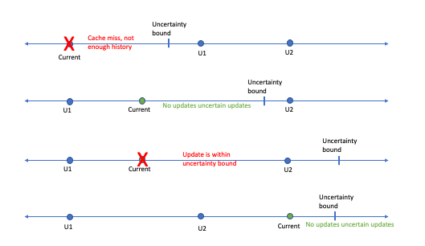

## 条件更新 和MVCC

> Multi-Version Concurrency Control 多版本[并发控制](https://baike.baidu.com/item/并发控制/3543545?fromModule=lemma_inlink)，

VOS支持对单个dkey和key进行条件操作。支持以下操作:

- 条件获取：如果键存在则获取，否则用- der_nonexist失败
- 条件更新：如果键存在则更新，否则使用- der_nonexist失败
- 条件插入：如果键不存在则更新，否则使用- der_exist失败
- 条件打孔：如果键存在则打孔，否则以- der_nonexist失败

这些操作提供了原子操作，支持某些需要原子操作的用例。条件操作使用存在检查和读取时间戳的组合来实现。读时间戳使有限的MVCC能够防止读/写竞争，并提供可串行性保证。

## VOS时间戳缓存

VOS维护一个读写时间戳的内存缓存，以强制MVCC语义。时间戳缓存由两部分组成。

1. 负入口缓存：每个目标的全局数组，包括对象、dkeys和akeys。每层的索引由父实体的索引(如果是容器，则为0)和所述实体的散列值的组合确定。如果两个不同的键映射到同一个索引，则它们共享时间戳条目。这可能会导致一些错误的冲突，但只要有进展，就不会影响正确性。该数组用于存储VOS树中不存在的项的时间戳。创建项后，它将使用下面第2部分描述的机制。请注意，同一个目标中的多个池使用此共享缓存，因此在实体存在之前，也可能出现跨池的虚假冲突。这些条目在启动时使用启动服务器的全局时间进行初始化。这确保了强制重启之前的任何更新，以确保我们保持自动性，因为当服务器宕机时，时间戳数据会丢失。
2. 正入口缓存：每个目标为现有的容器、对象、dkey和akey提供LRU缓存。每个级别使用一个LRU数组，这样容器、对象、dkey和akey只与相同类型的缓存项冲突。当现有项从缓存中移除时，一些准确性会丢失，因为这些值将与上文#1中描述的对应负项合并，直到该项被带回到缓存中。缓存项的索引存储在VOS树中，但它仅在运行时有效。在服务器重启时，LRU缓存从重启发生时的全局时间初始化，所有条目自动失效。在一个新项进入LRU时，使用对应的负项进行初始化。LRU项的索引存储在VOS树中，后续访问的查找时间为O(1)。

读时间戳
时间戳缓存中的每个条目都包含两个读时间戳，以便为DAOS操作提供可串行化保证。这些时间戳是

1. 一个低时间戳(entity.low)，表示根在该实体的子树中所有节点都已在entity.low处读取
2. 一个高时间戳(entity.high)，表示在以该实体为根的子树中，至少有一个节点在entity.high被读取。
   对于任何叶节点(即key)， low == high;对于任何非叶节点，low <= high。

这些时间戳的用法如下所述

写时间戳
为了检测违反纪元不确定性，VOS还为每个容器、对象、dkey和key维护了一对写时间戳。从逻辑上讲，时间戳表示对实体本身或子树中某个实体的最近两次更新。如果以后有任何更新，则需要至少两个时间戳，以避免假定不确定性。下图显示了至少需要两个时间戳。如果只使用一个时间戳，第一、第二和第三种情况将无法区分，并将作为不确定情况而被拒绝。所有情况下都使用最精确的写时间戳。例如，如果访问是一个数组，我们将检查对应键或对象没有不确定的冲击时的冲突范围。

说明写时间戳缓存效用的场景

