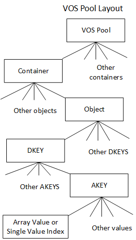

# 版本对象存储（VOS）

版本化对象存储(VOS)负责提供和维护持久对象存储，该存储支持字节粒度访问和[DAOS池](https://github.com/daos-stack/daos/blob/master/docs/storage_model.md#DAOS_Pool)中单个分片(shard)的版本控制。它在持久性内存中维护其元数据，根据可用存储和性能要求，数据可以存储在持久性内存中，也可以存储在块存储（block storage）中。它必须以最小的开销提供该功能，以便在延迟和带宽方面的性能尽可能接近底层硬件的理论性能。它在持久和非持久内存中的内部数据结构也必须支持最高级别的并发，以便在现代处理器体系结构的核心上扩展吞吐量。最后，至关重要的是，它必须验证所有持久化对象数据的完整性，以消除静默数据损坏的可能性，无论是在正常操作中还是在所有可能的可恢复故障下。

本节提供实现上述为DAOS构建版本化对象存储时讨论的设计目标的详细信息。

本文档包含以下内容:

- Persistent Memory based Storage
  - [In-Memory Storage](https://github.com/daos-stack/daos/tree/master/src/vos#63)
  - [Lightweight I/O Stack: PMDK Libraries](https://github.com/daos-stack/daos/tree/master/src/vos#64)
- VOS Concepts
  - [VOS Indexes](https://github.com/daos-stack/daos/tree/master/src/vos#711)
  - [Object Listing](https://github.com/daos-stack/daos/tree/master/src/vos#712)
- Key Value Stores
  - [Operations Supported with Key Value Store](https://github.com/daos-stack/daos/tree/master/src/vos#721)
  - [Key in VOS KV Stores](https://github.com/daos-stack/daos/tree/master/src/vos#723)
  - [Internal Data Structures](https://github.com/daos-stack/daos/tree/master/src/vos#724)
- [Key Array Stores](https://github.com/daos-stack/daos/tree/master/src/vos#73)
- Conditional Update and MVCC
  - [VOS Timestamp Cache](https://github.com/daos-stack/daos/tree/master/src/vos#821)
  - [Read Timestamps](https://github.com/daos-stack/daos/tree/master/src/vos#822)
  - [Write Timestamps](https://github.com/daos-stack/daos/tree/master/src/vos#823)
  - [MVCC Rules](https://github.com/daos-stack/daos/tree/master/src/vos#824)
  - [Punch Propagation](https://github.com/daos-stack/daos/tree/master/src/vos#825)
- Epoch Based Operations
  - [VOS Discard](https://github.com/daos-stack/daos/tree/master/src/vos#741)
  - [VOS Aggregate](https://github.com/daos-stack/daos/tree/master/src/vos#742)
- [VOS Checksum Management](https://github.com/daos-stack/daos/tree/master/src/vos#79)
- [Metadata Overhead](https://github.com/daos-stack/daos/tree/master/src/vos#80)
- Replica Consistency
  - [DAOS Two-phase Commit](https://github.com/daos-stack/daos/tree/master/src/vos#811)
  - [DTX Leader Election](https://github.com/daos-stack/daos/tree/master/src/vos#812)


## 基于持久性内存的存储

### In-Memory Storage

VOS被设计为使用持久化内存存储模型，利用新的NVRAM技术可能实现的字节粒度、亚微秒级存储访问。与传统的存储系统相比，应用程序和系统元数据以及小的、碎片化的和不对齐的I/O的性能发生了颠覆性的变化。直接访问字节可寻址的低延迟存储开辟了新的领域，元数据可以在不到一秒的时间内扫描，而无需费心查找时间和对齐。

VOS依赖于基于日志的体系结构，使用持久性内存主要维护内部持久性元数据索引。实际数据可以直接存储在持久内存中，也可以存储在基于块的NVMe存储中。DAOS服务有两层存储:存储类内存(SCM)用于字节粒度的应用程序数据和元数据，NVMe用于批量应用程序数据。与目前使用PMDK方便访问SCM类似，存储性能开发工具包([SPDK](https://spdk.io/))提供对NVMe ssd的无缝高效访问。当前的DAOS存储模型涉及每个内核三个DAOS Server xstream，以及映射到NVMe SSD设备的每个内核一个主DAOS服务器xstream。DAOS存储分配可以通过使用PMDK pmemobj池在SCM上进行，也可以通过使用SPDK blob在NVMe上进行。所有本地服务器元数据将存储在SCM上的每个服务器pmemobj池中，并将包括所有当前的和相关的NVMe设备、池和xstream映射信息。请参阅[Blob I/O](https://github.com/daos-stack/daos/blob/master/src/bio/README.md) (BIO)模块以获取有关NVMe、SPDK和每服务器元数据的更多信息。在开发和修改VOS层时要特别注意，因为任何软件缺陷都可能破坏持久内存中的数据结构。因此，尽管存在硬件ECC, VOS仍然对其持久数据结构进行校验和。

VOS充分利用为支持这种编程模型而开发的[PMDK](https://github.com/daos-stack/daos/blob/master/src/vos/pmem.io)开源库，在用户空间中提供了一个轻量级的I/O堆栈。

### Lightweight I/O Stack: PMDK Libraries

虽然持久性内存可以通过直接加载/存储访问，但更新需要通过多级缓存，包括处理器L1/2/3缓存和NVRAM控制器。只有在所有这些缓存都显式刷写之后，才可以保证持久性。VOS在持久内存中维护内部数据结构，这些数据结构必须保持一定程度的一致性，以便在意外崩溃或停电后恢复操作而不会丢失持久数据。对一个请求的处理通常会导致多次内存分配和更新，这些都必须以原子方式应用。

因此，必须在持久性内存之上实现事务接口，以保证内部VOS的一致性。值得注意的是，这种事务不同于DAOS事务机制。在处理传入的请求时，持久性内存事务必须保证VOS内部数据结构的一致性，无论它们的纪元数是多少。持久性内存上的事务可以通过许多不同的方式实现，例如，撤销日志、重做日志，两者的组合，或者写时复制。

[PMDK](https://pmem.io/)是一个使用持久性内存的开源库集合，专门针对NVRAM进行了优化。其中包括libpmemobj库，它实现了称为持久性内存池的可重定位持久性堆。这包括内存分配、事务和用于持久内存编程的一般设施。事务在一个线程(不是多线程)中是本地的，并且依赖于undo日志。正确使用API可以确保在服务器发生故障后打开内存池时，所有内存操作都回滚到最后提交的状态。VOS利用这个API来确保VOS内部数据结构的一致性，即使在服务器故障的情况下。


## VOS 概念

版本化对象存储通过将VOS池(vpool)初始化为DAOS池的一个shard，提供存储目标本地的对象存储。vpool可以为多个对象地址空间(称为容器)保存对象。每个vpool在创建时都有一个唯一的UID，与DAOS池的UID不同。VOS还维护并提供了一种方法来提取统计信息，如总空间、可用空间和vpool中对象的数量。

VOS的主要目的是捕获并记录任意时间顺序的对象更新，并将这些更新集成到一个有序的、可按需高效遍历的纪元历史中。通过正确排序冲突的更新，而不需要及时序列化它们，这为并行I/O提供了重大的可伸缩性改进。例如，如果两个应用程序进程就如何解决给定更新上的冲突达成一致，它们可以独立地编写更新，并确保它们将在VOS上按正确的顺序解决。

VOS还允许丢弃与给定纪元和进程组相关的所有对象更新。此功能确保在必须放弃DAOS事务时，在为该进程组提交epoch之前，所有相关的更新都是不可见的，并成为不可变的。这确保了分布式更新是原子的——即当一个提交完成时，要么所有的更新已经被应用，要么被丢弃。

最后，VOS可以聚合对象的历史记录，以回收不可访问数据所占用的空间，并通过简化索引来加快访问速度。例如，当一个数组对象在给定的epoch内被“打孔”从0到∞时，容器一旦关闭，在此epoch之前的最新快照之后更新的所有数据都将变得不可访问。

在内部，VOS维护一个容器uuid的索引，该索引引用存储在特定池中的每个容器。容器本身包含三个索引。第一个是对象索引，用于在处理I/O请求时有效地将对象ID和epoch映射到对象元数据。另外两个索引用于维护活动和已提交的[DTX](https://github.com/daos-stack/daos/tree/master/src/vos#811)记录，以确保跨多个副本的高效更新。

DAOS支持两种类型的值，每种类型都与一个分布键(DKEY)和一个属性键(AKey)相关联:单个值和数组值。DKEY用于放置，确定使用哪个VOS池来存储数据。键标识了要存储的数据。同时指定DKEY和key的能力为应用程序提供了在DAOS中分发或共存不同值的灵活性。单个值是一个原子值，这意味着写入键时更新整个值，读取时获取最新的完整值。数组值是大小相同的记录的索引。对数组值的每次更新只影响指定的记录，并读取对请求的每个记录索引的最新更新。每个VOS池维护VOS提供了容器、对象、dkey、akey和值的每个容器层次结构，如下所示[下面](https://github.com/daos-stack/daos/tree/master/src/vos#7a)。DAOS API提供了构建在此基础接口上的通用键值和数组抽象。前者将DKEY设置为用户指定的密钥，并使用固定的密钥。后者使用数组索引的上位来创建DKEY，并使用固定的key，从而将数组索引均匀地分布到对象布局中的所有VOS池中。对于VOS描述的其余部分，Key-Value和Key-Array应使用来描述VOS布局，而不是这些简化的抽象。换句话说，它们应该描述单个VOS池中的dkey - key - value。

VOS对象不是显式创建的，而是在第一次写入时通过创建对象元数据并在所属容器的对象索引中插入对它的引用来创建的。所有对象更新都会记录每次更新的数据，这些更新可能是对象、DKEY、key、单个值、数组值punch或单个值或数组值的更新。请注意，数组对象区段的“击打”记录为零区段，而不是导致相关的数组区段或键值被丢弃。对对象、DKEY、key或单个值的击打会被记录，因此在以后的时间戳读取时不会看到任何数据。这确保了对象的完整版本历史仍然可以访问。然而，DAOS api只允许在快照中访问数据，因此VOS聚合可以积极地删除在已知快照中不再访问的对象、键和值。



在查找对象中的单个值时，遍历对象索引，以找到索引中与键匹配的历元数(近历元数)小于或等于请求的历元数的最大节点。如果找到值或负数，则返回。否则，返回一个"miss"，意味着这个键在这个VOS中从未更新过。这确保返回的是纪元历史中最近的值，而不管它们整合的时间顺序如何，并且忽略请求纪元之后的所有更新。

类似地，在读取数组对象时，遍历它的索引以创建一个聚集描述符，该描述符收集请求区间中所有纪元数小于或等于请求纪元数的对象区段片段。聚集描述符中的条目要么引用一个包含数据的区间，一个请求者可以解释为全0的穿孔区间，要么引用一个“miss”，意味着这个VOS在这个区间内没有收到任何更新。同样，这确保了对于请求范围内的所有偏移量，返回数组纪元历史中最近的数据，而不管它们的写入时间顺序如何，并且忽略请求纪元之后的所有更新。


### VOS Indexes

对象索引表的值，由OID索引，指向一个DKEY索引。DKEY索引中的值指向一个key索引。key索引中的值(由key索引)指向单个值索引或数组索引。epoch引用单个值索引，并返回在epoch时或之前插入的最新值。数组值由范围和epoch索引，并将返回该epoch可见的区段的部分。

关于对象期望的提示可以编码在对象ID中。例如，一个对象可以被复制、纠删编码、使用校验和，或者具有整数或词法dkey和/或akey。如果使用整数键或词法键，对象索引是按键排序的，这使得查询(如数组大小)更加高效。否则，键将根据索引中的散列值进行排序。128位。上面的32位用于编码对象类型和键类型，而下面的96位是用户定义的标识符，必须与容器唯一。

每个对象、dkey和key都有一个关联的化身日志。化身日志可以被描述为关联实体的创建和打孔事件的有序日志。该值路径中的每个实体都会被检查日志，以确保该实体以及该值在请求的时间是可见的。

### Object Listing

VOS提供了一个通用迭代器，可用于迭代VOS池中的容器、对象、dkey、akey、单个值和数组区段。迭代API如下面的[图](https://github.com/daos-stack/daos/tree/master/src/vos#7b)所示。

```
/**
 * Iterate VOS entries (i.e., containers, objects, dkeys, etc.) and call \a
 * cb(\a arg) for each entry.
 *
 * If \a cb returns a nonzero (either > 0 or < 0) value that is not
 * -DER_NONEXIST, this function stops the iteration and returns that nonzero
 * value from \a cb. If \a cb returns -DER_NONEXIST, this function completes
 * the iteration and returns 0. If \a cb returns 0, the iteration continues.
 *
 * \param[in]		param		iteration parameters
 * \param[in]		type		entry type of starting level
 * \param[in]		recursive	iterate in lower level recursively
 * \param[in]		anchors		array of anchors, one for each
 *					iteration level
 * \param[in]		cb		iteration callback
 * \param[in]		arg		callback argument
 *
 * \retval		0	iteration complete
 * \retval		> 0	callback return value
 * \retval		-DER_*	error (but never -DER_NONEXIST)
 */
int
vos_iterate(vos_iter_param_t *param, vos_iter_type_t type, bool recursive,
	    struct vos_iter_anchors *anchors, vos_iter_cb_t cb, void *arg);
```

泛型VOS迭代器API启用了DAOS枚举API以及支持重建、聚合和丢弃的DAOS内部特性。它足够灵活，可以遍历指定epoch范围内的所有键、单个值和区段。此外，它支持通过可见范围进行迭代。


## Key Value Stores (Single Value)

高性能模拟产生大量数据时，需要对数据进行索引和分析，以获得良好的洞察力。Key Value (KV)存储在简化复杂数据的存储和高效处理方面起着至关重要的作用。

VOS在持久性内存上提供了一个多版本、并发的KV存储，它可以动态增长，并提供快速的近历元检索和键值枚举。

虽然之前有一系列关于KV存储的工作，但大多数都专注于云环境，并没有提供有效的版本支持。一些KV存储提供了版本控制支持，但期望版本的顺序是单调递增的，而且没有近历元检索的概念。

VOS必须能够在任何时间插入KV对，并且必须能够对任何键值对象的并发更新和查找提供良好的可扩展性。KV对象还必须能够支持任何类型和大小的键和值。

### Operations Supported with Key Value Store

VOS支持四种类型的大键和大值操作。更新、查找、打孔和键枚举。

update和punch操作会将一个新键添加到KV存储中，或者记录一个已有键的新值。Punch记录特殊值“Punch”，实际上是一个负数条目，用来记录删除键时的时间。对于同一个对象、键、值或范围的更新和击打，都不允许使用相同的epoch，当试图这样做时，VOS将返回错误。

Lookup遍历KV元数据，以确定给定键在给定时期的状态。如果根本没有找到键，则返回一个"miss"，表示该键在该VOS中不存在。否则，返回小于或等于请求的epoch的近epoch或最大epoch的值。如果是特殊的“打孔”值，则意味着该键在指定的时间内被删除了。这里的值指的是内部树数据结构中的值。KV-object的键值记录作为其节点的值存储在树中。因此，在穿孔的情况下，这个值包含一个“特殊的”返回码/标志来标识穿孔操作。

VOS还支持枚举属于特定纪元的键。


### Key in VOS KV Stores

VOS KV支持从小到超大的密钥长度。对于key和dkey, VOS支持散列键或两种“直接”键:词法键或整数键。

#### Hashed Keys

最灵活的键类型是散列键。VOS对用户提供的键运行两种快速散列算法，并使用组合散列后的键值作为索引。组合散列的目的是避免键之间的冲突。为了保证正确性，仍然需要比较实际的键。

#### Direct Keys

使用散列后的键会产生无序的键。在用户的算法可能从排序中受益的情况下，这是有问题的。因此，VOS支持两种类型的键，它们不散列，而是直接解释。

##### Lexical Keys

词法键使用词法排序进行比较。这使得诸如排序字符串之类的用法成为可能。目前，词法键的长度被限制在80个字符以内。

##### Integer Keys

整数键是无符号的64位整数，因此进行比较。这使得像DAOS数组API这样的用例可以使用索引的上位作为dkey，下位作为偏移量。这使得此类对象能够使用DAOS键查询API来更有效地计算大小。

VOS中的KV存储允许用户以随机顺序维护不同KV对的版本。例如，一次更新可能发生在epoch 10，然后在epoch 5进行另一次更新，其中HCE小于5。为了提供这种级别的灵活性，KV存储中的每个键都必须保持更新/打孔的周期。索引树中元素的排序首先基于键，然后基于年代。这种排序允许相同键值的epoch落在同一子树中，从而最小化搜索成本。使用稍后描述的[DTX](https://github.com/daos-stack/daos/tree/master/src/vos#81)执行冲突解决和跟踪。DTX确保副本是一致的，失败或未提交的更新在外部不可见。

### Internal Data Structures

设计VOS KV存储需要一种树型数据结构，它可以动态增长并保持自平衡。树需要进行平衡，以确保时间复杂度不会随着树大小的增加而增加。树的数据结构有红黑树和B+树，前者是二叉查找树，后者是n元查找树。

尽管与AVL树相比，红黑树提供的平衡不那么严格，但它们通过更低的再平衡成本进行了补偿。红黑树在Linux内核、java-util库和c++标准模板库等例子中应用更为广泛。B+树与B树的不同之处在于，它们没有与内部节点相关联的数据。这可以方便在一页内存中放置更多的键。此外，B+树的叶节点是相互连接的;这意味着，与B树相比，进行一次完整的扫描只需要线性遍历所有的叶节点，这可以潜在地减少访问数据时的缓存缺失。

如前一节所述([键值存储支持的操作](https://github.com/daos-stack/daos/tree/master/src/vos#721))，为了支持更新和打卡，为每个更新或打卡请求设置一个纪元有效性范围以及相关的键，这将标记键从当前纪元到可能的最高纪元有效。更新同一个键在未来或过去的epoch上修改前一个更新或punch的结束epoch有效性。这样，对于任何给定的键-历元对查找，只有一个键的有效范围，而整个键的更新历史都会被记录下来。这有助于最近时间搜索。punch和update都有类似的键，除了一个简单的标志，用于标识被查询时间上的操作。查找必须能够在给定的时间内搜索给定的键并返回相关联的值。除了时间有效性范围之外，DAOS生成的容器句柄cookie也与树的键一起存储。如果在同一时间发生重写，则需要此cookie来识别行为。

下面的[表](https://github.com/daos-stack/daos/tree/master/src/vos#7c)中列出了一个创建KV存储的简单输入示例。基于B+树的索引和基于红黑树的索引分别显示在下面的[表](https://github.com/daos-stack/daos/tree/master/src/vos#7c)和[图](https://github.com/daos-stack/daos/tree/master/src/vos#7d)中。出于解释的目的，本例中使用了具有代表性的键和值。

**Example VOS KV Store input for Update/Punch**

| Key   | Value   | Epoch | Update (U/P) |
| ----- | ------- | ----- | ------------ |
| Key 1 | Value 1 | 1     | U            |
| Key 2 | Value 2 | 2     | U            |
| Key 3 | Value 3 | 4     | U            |
| Key 4 | Value 4 | 1     | U            |
| Key 1 | NIL     | 2     | P            |
| Key 2 | Value 5 | 4     | U            |
| Key 3 | Value 6 | 1     | U            |


红黑树和任何传统的二叉树一样，将小于根结点的键组织到左边的子树中，大于根结点的键组织到右边的子树中。值指针和键一起存储在每个节点中。另一方面，基于B+树的索引将键按升序存储在叶子节点，而叶子节点就是存储值的地方。根节点和内部节点(相应地用蓝色和栗色编码)便于定位适当的叶节点。每个B+树节点有多个位置，位置的数量由顺序决定。节点最多可以有1个序号。在红黑树的情况下，容器句柄cookie必须与每个键一起存储，但在B+树的情况下，只有叶节点上的cookie就足够了，因为遍历时不使用cookie。

在下面的[表](https://github.com/daos-stack/daos/tree/master/src/vos#7e)中，n是树中条目的数量，m是键的数量，k是键的数量，两个唯一键之间的epoch条目。

**Comparison of average case computational complexity for index**

| Operation   | Red-black tree          | B+Tree              |
| ----------- | ----------------------- | ------------------- |
| Update      | O(log2n)                | O(logbn)            |
| Lookup      | O(log2n)                | O(logbn)            |
| Delete      | O(log2n)                | O(logbn)            |
| Enumeration | O(m* log2(n) + log2(n)) | O(m * k + logb (n)) |

虽然这两种解决方案都是可行的实现，但确定理想的数据结构将取决于这些数据结构在持久性内存硬件上的性能。

VOS还支持对这些结构的并发访问，这要求所选择的数据结构在并发更新时提供良好的可伸缩性。与B+树相比，红黑树的再平衡对树结构的影响更大;因此，B+树可以提供更好的并发访问性能。此外，由于B+树节点包含许多槽，具体位置取决于每个节点的大小，因此可以更容易地在缓存中预取数据。此外，上述[表](https://github.com/daos-stack/daos/tree/master/src/vos#7e)中的顺序计算复杂性表明，与红黑树相比，基于B+树的合理顺序KV存储可以表现得更好。

VOS支持枚举在给定时间内有效的键。VOS提供了一种基于迭代器的方法来从KV对象中提取所有的键和值。基本上，KV索引是按键排序的，然后按epoch排序的。由于每个键都保存着很长的更新历史，树的大小可能非常大。红黑树枚举的渐进复杂度为O(m* log (n) + log (n))，其中m是在请求的迭代周期内有效的键数。在树中查找第一个元素的时间为O(log2 (n))，查找后继元素的时间为O(log2 (n))。因为需要检索“m”个键，所以这个枚举的复杂度为O(m * log2 (n))。

在B+-树的情况下，叶节点是升序排列的，枚举将直接解析叶节点。其复杂度为O (m * k + logbn)，其中m是一个epoch内有效的键的个数，k是B+树中两个不同键之间的元素个数，B是B+树的顺序。如果两个不同的键之间有"k"个epoch元素，那么时间复杂度为O(m * k)，而定位树中最左边的第一个键则需要额外的O(logbn)。如上面的[图](https://github.com/daos-stack/daos/tree/master/src/vos#7d)所示的通用迭代器接口也将用于KV枚举。

除了枚举一个epoch内有效的对象的键，VOS还支持枚举两个epoch之间修改的对象的键。epoch索引表提供了每个epoch中更新的键。通过聚合与每个epoch相关联的键列表，VOS可以生成一个具有最新epoch的键列表(通过保持键的最新更新并丢弃旧版本)。通过在关联的索引数据结构中查找列表中的每个键，VOS可以使用基于迭代器的方法提取值。


## Key Array Stores

VOS支持的第二种对象是键数组对象。与KV存储类似，数组对象允许多个版本，并且必须能够同时写入、读取和输入字节范围的任何部分。下面的[图](https://github.com/daos-stack/daos/tree/master/src/vos#7f)显示了一个键数组对象中的区段和纪元安排的简单示例。在本例中，不同的线表示存储在各自区段中的实际数据，并对写入该区段范围的不同线程进行颜色编码。

**Example of extents and epochs in a Key Array object**


在[上面](https://github.com/daos-stack/daos/blob/master/src/vos/7f)的例子中，不同的区段范围之间有显著的重叠。VOS支持最近历元访问(nearest-epoch access)，这要求读取任何给定区间的最新值。例如，在上面的[图](https://github.com/daos-stack/daos/tree/master/src/vos#7f)中，如果对纪元10的区段范围4- 10有一个读请求，那么结果读取缓冲区应该包含纪元9的区段7-10、纪元8的区段5-7和纪元1的区段4-5。VOS数组对象还支持部分范围和完整范围的punch。


**Example Input for Extent Epoch Table**

| Extent Range | Epoch | Write (or) Punch |
| ------------ | ----- | ---------------- |
| 0 - 100      | 1     | Write            |
| 300 - 400    | 2     | Write            |
| 400 - 500    | 3     | Write            |
| 30 - 60      | 10    | Punch            |
| 500 - 600    | 8     | Write            |
| 600 - 700    | 9     | Write            |


r -树提供了一种合理的方式来表示范围和历元有效性范围，从而限制处理读请求所需的搜索空间。VOS提供了一种特殊的r树，称为区间有效性树(Extent-Validity tree, EV-Tree)来存储和查询版本化数组索引。在传统的r树实现中，矩形是有界且不可变的。在VOS中，“矩形”由一个轴上的范围和另一个轴上的纪元有效性范围组成。然而，在插入矩形时，历元的有效范围是未知的，因此所有矩形的插入都是假设上界为无穷大。最初，DAOS设计要求在insert上分裂这种in-tree矩形以限制有效性范围，但由于一些因素导致决定保持原始有效性范围。首先，更新持久性内存的开销比查找高一个数量级。其次，快照之间的重写可以通过聚合删除，从而保持相当小的重叠写入历史。因此，EV-Tree实现了一个由两部分组成的取指算法。

1. 找出所有重叠区段。这将包括请求周期之前发生的所有写操作，即使它们已经被后续的写操作覆盖。
2. 按范围开始，然后按纪元排序
3.遍历有序数组，必要时拆分区段并尽可能地标记它们
4. 重新排序数组。最后的排序可以根据用例选择保留或丢弃空洞和覆盖的区段。

TODO:创建一个新的图形**Rectangles表示extent_range。epoch_validity使用[上面的表](https://github.com/daos-stack/daos/tree/master/src/vos#7g)**

[](https://github.com/daos-stack/daos/blob/master/docs/graph/Fig_016.png)

下图[下图](https://github.com/daos-stack/daos/blob/master/src/vos/7l)显示了使用EV-Tree的分裂和裁剪操作构造的矩形，用于前面[表](https://github.com/daos-stack/daos/tree/master/src/vos#7g)中的示例，在偏移量{0 - 100}处额外写入，以考虑广泛分裂的情况。上图[上图](https://github.com/daos-stack/daos/tree/master/src/vos#7k)显示了相同示例的EV-Tree构造。

**Tree (order - 4) for the example in Table 6 3 (pictorial representation shown in the figure [above](https://github.com/daos-stack/daos/tree/master/src/vos#7g)**

[](https://github.com/daos-stack/daos/blob/master/docs/graph/Fig_017.png)

ev树中的插入通过检查重叠来定位要插入的适当叶节点。如果多个边界框重叠，则选择放大最小的边界框。通过选择面积最小的边界框来解决进一步的连接。每次插入操作的最大开销可能是O (logbn)。

除了上面描述的假重叠问题之外，EV-Tree的搜索工作与R-Tree类似。必须寻找所有重叠的内部节点，直到找到匹配的内部节点和叶节点。由于区间范围可以跨越多个矩形，因此一次搜索可以搜索到多个矩形。在理想情况下(整个区间都落在一个矩形上)，读取开销为O(logbn)，其中b是树的顺序。排序和拆分阶段会增加O(n log n)的额外开销，其中n是匹配的区段数量。在最坏的情况下，这相当于树中的所有区段，但由于聚合和单个键对应的单个分片对应的树相对较小，这种情况会得到缓解。

对于从ev树中删除节点，可以使用与搜索相同的方法来定位节点，并且可以删除节点/槽。一旦叶子节点被删除，为了合并多个表项数小于order/2的叶子节点，需要进行重新插入。EV-tree会进行重新插入(而不是像B+树那样合并叶节点)，因为在删除叶节点/叶槽时，边界框的大小会发生变化，并且确保矩形组织成最小边界框而没有不必要的重叠是很重要的。在VOS中，仅在聚合和丢弃操作时需要delete。这些操作将在下一节中讨论([基于纪元的操作](https://github.com/daos-stack/daos/tree/master/src/vos#74))。


## Conditional Update and MVCC

VOS支持对单个dkey和key进行条件操作。支持以下操作:

- 条件取指:如果键存在则取，否则用- der_nonexist失败
- 条件更新:如果键存在则更新，否则使用- der_nonexist失败
- 条件式插入:如果键不存在则更新，否则使用- der_exist失败
- 条件打孔:如果键存在则打孔，否则以- der_nonexist失败

这些操作提供了原子操作，支持某些需要原子操作的用例。条件操作使用存在检查和读取时间戳的组合来实现。读时间戳使有限的MVCC能够防止读/写竞争，并提供可串行性保证。

### VOS Timestamp Cache

VOS维护一个读写时间戳的内存缓存，以强制MVCC语义。时间戳缓存由两部分组成。

1. 负入口缓存。每个目标的全局数组，包括对象、dkeys和akeys。每层的索引由父实体的索引(如果是容器，则为0)和所述实体的散列值的组合确定。如果两个不同的键映射到同一个索引，则它们共享时间戳条目。这可能会导致一些错误的冲突，但只要有进展，就不会影响正确性。该数组用于存储VOS树中不存在的项的时间戳。创建项后，它将使用下面第2部分描述的机制。请注意，同一个目标中的多个池使用此共享缓存，因此在实体存在之前，也可能出现跨池的虚假冲突。这些条目在启动时使用启动服务器的全局时间进行初始化。这确保了强制重启之前的任何更新，以确保我们保持自动性，因为当服务器宕机时，时间戳数据会丢失。
2. 正入口缓存。每个目标为现有的容器、对象、dkey和akey提供LRU缓存。每个级别使用一个LRU数组，这样容器、对象、dkey和akey只与相同类型的缓存项冲突。当现有项从缓存中移除时，一些准确性会丢失，因为这些值将与上文#1中描述的对应负项合并，直到该项被带回到缓存中。缓存项的索引存储在VOS树中，但它仅在运行时有效。在服务器重启时，LRU缓存从重启发生时的全局时间初始化，所有条目自动失效。在一个新项进入LRU时，使用对应的负项进行初始化。LRU项的索引存储在VOS树中，后续访问的查找时间为O(1)。


### Read Timestamps

时间戳缓存中的每个条目都包含两个读时间戳，以便为DAOS操作提供可串行化保证。这些时间戳是

1. 低时间戳(entity.low)表示根在该实体的子树中* *所有* *节点都已在entity.low处读取
2. 高时间戳(entity.high)表示在以该实体为根的子树中*至少*有一个节点已经在entity.high被读取。

对于任何叶节点(即key)， low == high;对于任何非叶节点，low <= high。

[下面](https://github.com/daos-stack/daos/tree/master/src/vos#824)描述了这些时间戳的用法。


### Write Timestamps

为了检测违反纪元不确定性，VOS还为每个容器、对象、dkey和key维护了一对写时间戳。从逻辑上讲，时间戳表示对实体本身或子树中某个实体的最近两次更新。如果以后有任何更新，则需要至少两个时间戳，以避免假定不确定性。[下图](https://github.com/daos-stack/daos/tree/master/src/vos#8a)显示了至少需要两个时间戳。如果只使用一个时间戳，第一、第二和第三种情况将无法区分，并将作为不确定情况而被拒绝。所有情况下都使用最精确的写时间戳。例如，如果访问是一个数组，我们将检查对应键或对象没有不确定的冲击时的冲突范围。

**Scenarios illustrating utility of write timestamp cache**


### MVCC Rules

每个DAOS I/O操作都属于一个事务。如果用户没有将操作与事务关联，则DAOS将此操作视为单操作事务。因此，上文定义的条件更新被视为包含条件检查的事务，如果检查通过，则是更新或打卡操作。

每笔交易都有一个纪元。单操作事务和条件更新事务从它们访问的冗余组服务器中获取epoch，快照读事务从快照记录中获取epoch，其他事务从它访问的第一个服务器的HLC中获取epoch。(早期的实现使用客户端HLCs来选择最后一种情况的epoch。为了放松客户端的时钟同步要求，后来的实现转移到使用服务器HLCs来选择epoch，同时引入客户端HLC跟踪器，跟踪客户端听说过的最高服务器HLC时间戳。)事务使用其epoch执行所有操作。

MVCC规则确保事务按照它们的epoch顺序序列化执行，同时确保每个事务在打开之前观察所有冲突事务，只要系统时钟偏移始终在预期的最大系统时钟偏移(epsilon)内。为方便起见，规则将I/O操作分为读和写:


  - Reads
      - Fetch akeys [akey level]
      - Check object emptiness [object level]
      - Check dkey emptiness [dkey level]
      - Check akey emptiness [akey level]
      - List objects under container [container level]
      - List dkeys under object [object level]
      - List akeys under dkey [dkey level]
      - List recx under akey [akey level]
      - Query min/max dkeys under object [object level]
      - Query min/max akeys under dkey [dkey level]
      - Query min/max recx under akey [akey level]
  - Writes
      - Update akeys [akey level]
      - Punch akeys [akey level]
      - Punch dkey [dkey level]
      - Punch object [object level]

每次读写都是在四个级别中的一个:容器、对象、dkey和key。一个操作被认为是对根在它的层次上的整个子树的访问。尽管这会引入一些错误的冲突(例如，链表操作与不改变链表结果的底层更新操作)，但这种假设简化了规则。

纪元e的读取遵循以下规则:

```
// Epoch uncertainty check
if e is uncertain
    if there is any overlapping, unaborted write in (e, e_orig + epsilon]
        reject

find the highest overlapping, unaborted write in [0, e]
if the write is not committed
    wait for the write to commit or abort
    if aborted
        retry the find skipping this write

// Read timestamp update
for level i from container to the read's level lv
    update i.high
update lv.low
```

A write at epoch e follows these rules:

```
// Epoch uncertainty check
if e is uncertain
    if there is any overlapping, unaborted write in (e, e_orig + epsilon]
        reject

// Read timestamp check
for level i from container to one level above the write
    if (i.low > e) || ((i.low == e) && (other reader @ i.low))
        reject
if (i.high > e) || ((i.high == e) && (other reader @ i.high))
    reject

find if there is any overlapping write at e
if found and from a different transaction
    reject
```

同时涉及读写的事务必须遵循这两套规则。作为优化，单读事务和快照(读)事务不需要更新读时间戳。然而，快照创建必须更新读取时间戳，就像它是读取整个容器的事务一样。

当事务被拒绝时，它会以相同的事务ID重新开始，但是周期更高。如果迭代周期大于原始迭代周期加上，则迭代周期是确定的，从而保证迭代周期不确定性检测导致的重新启动是有界的。

事务之间不可能发生死锁。只有当事务t_2需要等待事务t_1的写提交时，具有epoch e_1的事务t_1才能阻塞具有epoch e_2的事务t_2。由于使用了客户端缓存，t_1必须正在提交，而t_2可能正在读取或提交。如果t_2正在读取，则e_1 <= e_2。如果t_2正在提交，则e_1 < e_2。假设有一个事务循环到达死锁。如果周期包含一个提交-提交边，那么沿着周期的周期必须先增大后减小，从而导致矛盾。如果所有的边都在提交-读取，那么一定有两条这样的边在一起，从而导致一个矛盾:正在读取的事务不能阻塞其他事务。因此，我们不需要担心死锁。

如果一个实体的读取周期不断增加，那么对该实体的写入可能会因为该实体的读取时间戳不断增加而不断被拒绝。在daos_tx_restart调用期间引入了基于随机化的指数级退避(请参见d_backoff_seq)。这些对于dfs_move工作负载是有效的，在dfs_move工作负载中，读者也需要写入数据。


### Punch propagation

由于条件操作依赖于空语义，VOS读取操作，特别是列表操作可能非常昂贵，因为它们可能需要读取子树来查看实体是否为空。为了缓解这个问题，VOS转而进行冲孔传播。在打孔操作时，会读取父树，看看打孔操作是否会导致它为空。如果有，父树也会被打孔。传播目前停止在dkey级别，这意味着对象不会被击打。打孔传播只适用于打孔键，而不是值。


## Epoch Based Operations

Epochs提供了一种在不破坏更新/写入历史的情况下修改VOS对象的方法。每次更新都会消耗内存，而丢弃未使用的历史记录有助于回收未使用的空间。VOS提供了压缩写入/更新历史和回收每个存储节点空间的方法。VOS还支持在事务中止时回滚历史记录。DAOS API时间戳对应于VOS纪元。API只允许读取最新的状态或从持久快照中读取，持久快照只是给定时间的引用。

为了压缩epoch, VOS允许聚合快照之间的所有epoch，即任何键的最新epoch的值/区段数据总是保存在旧epoch上。这也确保了合并历史记录不会导致对一个epoch的独占性更新/写入的丢失。为了回滚历史，VOS提供了丢弃操作。

```
int vos_aggregate(daos_handle_t coh, daos_epoch_range_t *epr);
int vos_discard(daos_handle_t coh, daos_epoch_range_t *epr);
int vos_epoch_flush(daos_handle_t coh, daos_epoch_t epoch);
```

VOS中的聚合和丢弃操作接受一个聚合的周期范围，通常对应于持久快照之间的范围。


### VOS Discard

Discard强制删除不聚合的epoch。该操作仅在需要丢弃与pair关联的值/extent-data时才需要。在这个操作中，VOS从cookie索引表中查找与请求epoch范围内的每个cookie相关的所有对象，并通过检查它们各自的epoch有效性，直接从各自的对象树中删除这些记录。DAOS需要一个discard来服务中止请求。中止操作要求丢弃操作是同步的。

在丢弃过程中，需要查找key和字节数组矩形的end-epoch为(discard_epoch - 1)的节点/槽位。这意味着在现在被丢弃的epoch之前有一个更新，并且它的有效性被修改以支持近epoch查找。上一次更新的周期有效性必须扩展到无限，以确保未来在接近周期时的查找将获取键/范围的最后已知更新值。


### VOS Aggregate

在聚合过程中，VOS必须保留对键/区段范围的最新更新，并丢弃在持久快照中可见的其他更新。VOS可以自由地删除或合并键或区段，只要它不改变最新时间戳或任何持久快照时期的可见视图。聚合利用vos_iterate API找到持久快照之间的可见和隐藏项，并删除隐藏的键和扩展，合并连续的部分扩展，以减少元数据开销。聚合可能是一个昂贵的操作，但不需要消耗关键路径上的周期。一种特殊的聚合处理聚合，经常产生以避免阻塞持续的I/O。


## VOS Checksum Management

VOS负责在对象更新期间存储校验和，并在对象获取时检索校验和。校验和将与其他VOS元数据一起存储在存储类内存中。对于单值类型，存储单个校验和。对于数组值类型，可以根据块大小存储多个校验和。

**块大小**被定义为生成校验和的数据的最大字节数。区段以记录为单位定义，而块大小则以字节为单位定义。在计算某个区段所需的校验和数量时，需要记录的数量和记录的大小。校验和通常应该从块大小字节派生，但是，如果区间小于块大小或某个区间不是“块对齐”的，那么校验和可能从小于块大小的字节派生。

**块对齐**将有一个绝对偏移量，而不是I/O偏移量。因此，即使一个区间刚好或小于一个块大小字节，如果它跨越了对齐障碍，也可能有多个块。

### Configuration

校验和将在创建容器时为容器配置。校验和特定的属性可以包含在daos_cont_create API中。这个配置还没有完全实现，但是属性可能包括校验和类型、块大小和服务器端验证。

### Storage

校验和将存储在记录(vos_irec_df)或范围(evt_desc)结构中，对于单值类型和数组值类型都是如此。因为校验和的大小可以是可变的(取决于配置的校验和类型)，校验和本身会被添加到结构的末尾。在SCM (vos_reserve_single/vos_reserve_recx)上为持久结构分配内存时，包括了校验和所需的大小。

下图说明了VOS的总体布局以及校验和存储的位置。请注意，校验和类型实际上还没有存储在vos_cont_df中。


### Checksum VOS Flow (vos_obj_update/vos_obj_fetch)
在更新时，校验和是I/O描述符的一部分。然后，在akey_update_single/akey_update_recx中，校验和缓冲区指针包含在用于树更新的内部结构中(SV的是vos_rec_bundle, EV的是evt_entry_in)。如前所述，分配的持久结构的大小包括校验和的大小。最后，在存储记录(svt_rec_store)或区间(evt_insert)时，将校验和复制到持久结构的末尾。

在获取时，更新流程本质上是相反的。

作为参考，流中的关键交叉点如下:

- SV更新:vos_update_end—> akey_update_single—> svt_rec_store
- Sv Fetch: vos_fetch_begin—> akey_fetch_single—> svt_rec_load
- EV更新:vos_update_end—> akey_update_recx—> evt_insert
- EV Fetch: vos_fetch_begin—> akey_fetch_recx—> evt_fill_entry

### Marking data as corrupted

在发现数据损坏时，将用损坏标志标记bio_addr，以防止后续对已知损坏的数据进行验证。因为校验和筛选器将迭代vos对象，所以使用vos_iter API将对象标记为损坏。vos_iter_process()将获取发现损坏的iter句柄，并调用btree/evtree来更新包含bio_addr的持久格式结构。


## Metadata Overhead

有一个工具可以估算元数据开销。它在[storage estimator](https://github.com/daos-stack/daos/blob/master/src/client/storage_estimator/README.md)部分中有描述。


## Replica Consistency

DAOS支持多个副本以实现数据的高可用性。当目标在更新复制对象期间失败，并且以不一致的顺序在复制目标上应用并发更新时，副本之间可能出现不一致。

解决不一致性问题最直观的方法是分布式锁(distributed lock, DLM)，它被一些分布式系统使用，如Lustre。对于DAOS，一个具有强大的下一代硬件的用户空间系统，在多个独立的应用空间之间维护分布式锁将引入不可接受的开销和复杂性。相反，DAOS使用优化的两阶段提交事务来保证副本之间的一致性。

### Single redundancy group based DAOS Two-Phase Commit (DTX)

当一个应用程序想要修改(更新或冲击)一个多复制的对象或EC对象时，客户端将修改RPC发送给leader分片(通过下面讨论的[DTX leader Election](https://github.com/daos-stack/daos/tree/master/src/vos#812)算法)。leader将RPC分发给其他相关的分片，每个分片并行地进行修改。批量传输不经过leader转发，而是直接从客户端传输，通过充分利用客户端-服务器的带宽来改善负载均衡并降低延迟。

在进行修改之前，在每个相关的分片(包括leader和非leader)上启动一个名为` DTX `的本地事务，该事务具有客户端生成的DTX标识符，该标识符对于容器内的修改是唯一的。DTX中的所有修改都记录在DTX事务表中，对该表的反向引用保存在相关的修改记录中。局部修改完成后，每个非leader将DTX状态标记为“已准备”并回复leader。一旦leader完成了修改并且收到了所有非leader的成功回复，它就会将DTX状态设置为` committable `。如果任何分片执行修改失败，它将以失败回应leader, leader将全局中止DTX。一旦DTX被leader设置为` committable `或` aborted `，它就会以适当的状态返回给客户端。

客户端一旦收到leader的成功回复，就可以认为修改完成了，而不管DTX是否真的“提交”了。异步提交` committable ` DTX是leader的责任。如果` committable `计数或DTX年龄超过某些阈值，或者由于与后续修改的潜在冲突，DTX被其他调度的rpc承载，则会发生这种情况。

当一个应用需要从一个具有多个副本的对象中读取内容时，客户端可以将RPC发送到任何副本。在服务器端，如果相关的DTX已经提交或可提交，则可以返回记录。如果DTX state已经准备好，并且副本不是leader，它会回复客户端，告诉它将RPC发送给leader。如果它是leader并且处于` committed `或` committable `状态，那么该条目对应用程序是可见的。否则，如果leader上的DTX也准备好了，那么对于事务读取，通过返回-DER_INPROGRESS请求客户端等待并重试;对于非事务性读取，将忽略相关条目，并将最新提交的修改返回给客户端。

如果读操作引用的是一个EC对象，并且从数据分片(非leader)读取的数据有一个“准备好的”DTX，那么由于前面提到的异步批量提交机制，该数据在leader上可能是“可提交的”。在这种情况下，非leader将刷新与leader相关的DTX状态。如果刷新后的DTX状态为'committed'，则可以将相关数据返回给客户端;否则，如果DTX状态仍然是'prepared'，那么对于事务读取，通过返回-DER_INPROGRESS请求客户端等待并重试;对于非事务性读取，将忽略相关条目，并将最新提交的修改返回给客户端。

DTX模型构建在DAOS容器内。每个容器维护自己的DTX表，在SCM中被组织为两棵B+树:一棵用于活动的DTX，另一棵用于已提交的DTX。下图表示了DTX模型下复制对象的修改。

**Modify multiple replicated object under DTX model**

[](https://github.com/daos-stack/daos/blob/master/docs/graph/Fig_066.png)


### Single redundancy group based DTX Leader Election

在基于单冗余组的DTX模型中，对每个对象或dkey进行leader选择遵循以下一般准则:

R1:当不同复制对象共享相同冗余组时，不应该为每个对象使用相同的leader。

R2:当有多个dkey的复制对象跨越多个冗余组时，不同冗余组中的leader应该在不同的服务器上。

R3: leader选择时要避免频繁故障的服务器，避免频繁的leader迁移。

R4:对于EC对象，leader将是当前冗余组中的校验节点之一。