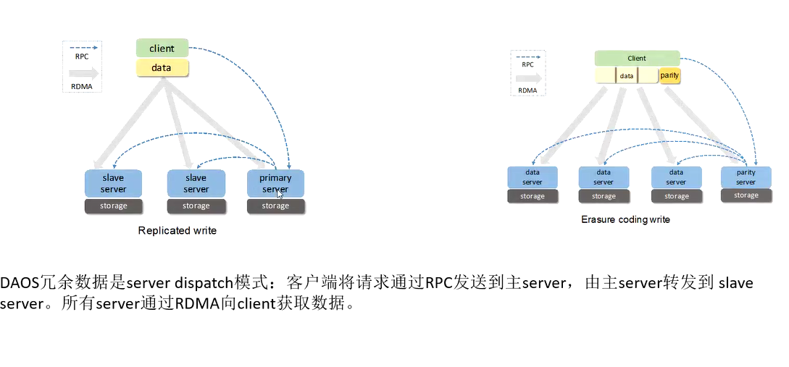

全闪环境，其中特点

* 高吞吐
  * 跑满大IO100G网卡，10-20w的时延 
* 低时延
  * us vs ms（大IO时延）
* 高扩展
  * 其他分布式扩展都挺好
* 全用户态
  * NVME SPDK
  * 网卡
  * IO栈

* 多协议
  * POSIX
  * HDFS

整体架构

CS架构

通信方式

* CaRT
* gRPC
* dRPC

DAOS Server

控制面（dao_server） +　数据面(daos_engine)

daos_engine和网卡绑定（多口网卡）

daos_server的作用

* 解析配置文件daos_server.yml, 配置存储并启动和监听dao_engnine一个或多个实例
* dao_engine是多进程，负责daos存储迎请，通过CaRT通信中间件处理传入的IO请求，PMDK->pmem, spdk->NVMe
* dao_engine依赖Argobots就实践的并行处理，任务最终的执行单元是targeet和ult

daos_engine的作用

* 每个IO来了创建ULT，target的调度器上去调度

## 内部模块

VOS(DTX)

VEA管理真正落到NVMe磁盘上的空间

RDMA 

大IO: 数据放到客户端，让server主动去客户端拉取数据

网： 控制面1000m管理网（命令之类），100G的业务网

元数据

pool container object都有元数据

RDB的粒度，是engine为粒度还是其他粒度。

一个target有一个vos pool

建议engine是2个

### POOL

资源的集合（SCM、NVMe、网络、CPU）

创建pool可以指定rank, rank上所有的target

如果CPU够，盘不够的情况，可以一个盘启动多个target

target的数量的盘的倍数，且不能超过CPU的数量-2，如果有4块盘，有8个CPU，每个盘需要承载多个target（target可以理解为盘的分区）

在pool内target承载的空间大小是平分的

一个target可以属于多个pool

为什么使用server dispatch而不是client dispatch

在client dispatch上事务存在数据不一致问题，而在server dispatch简单且无数据不一致问题。

 